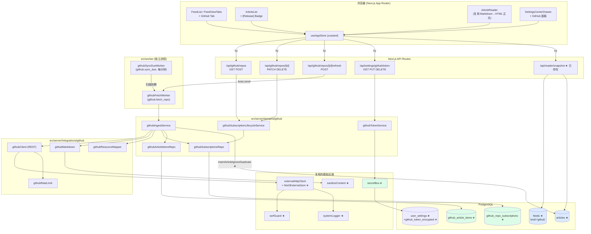
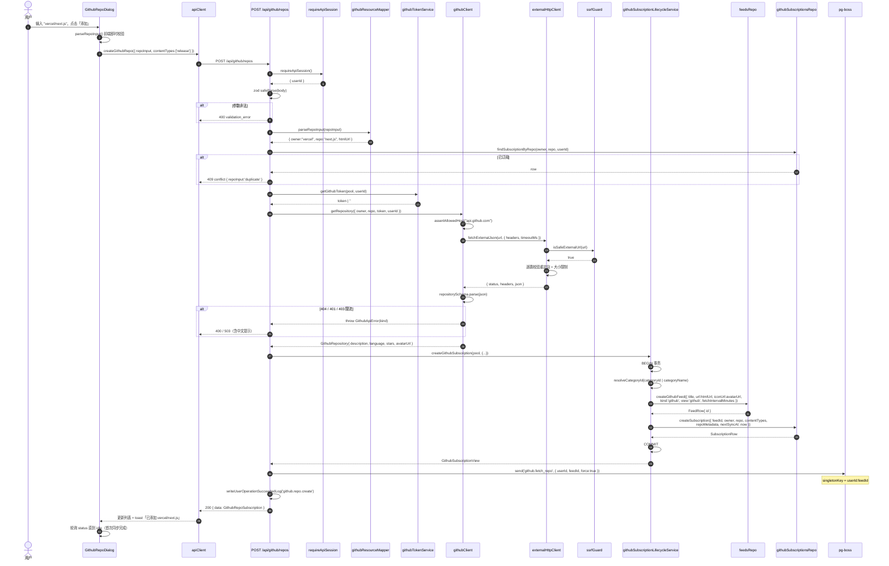
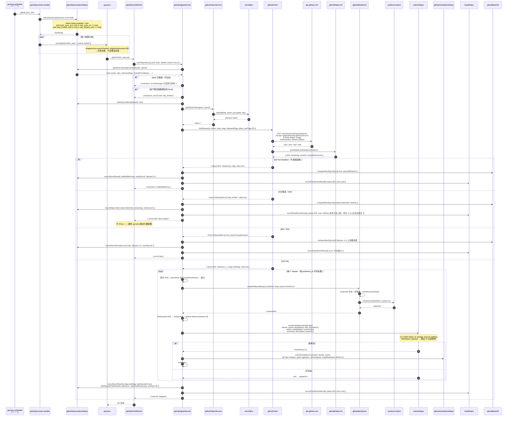
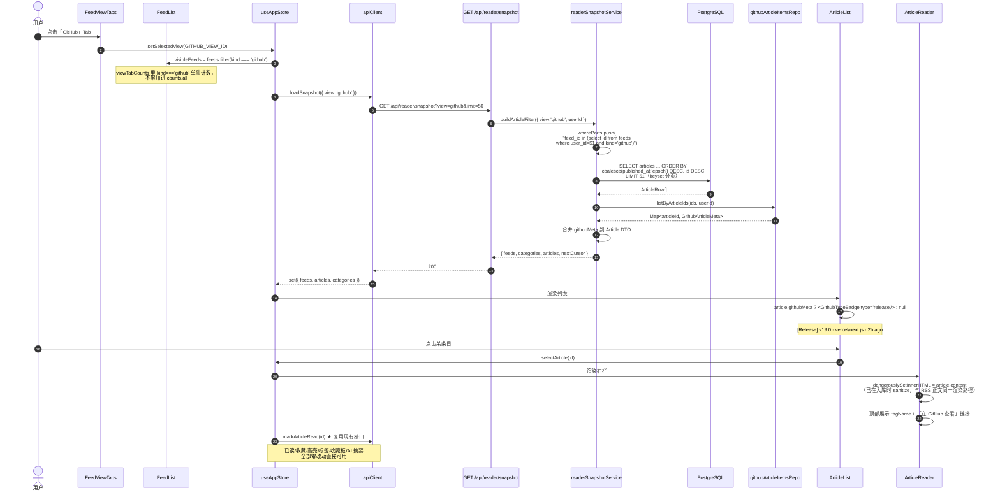
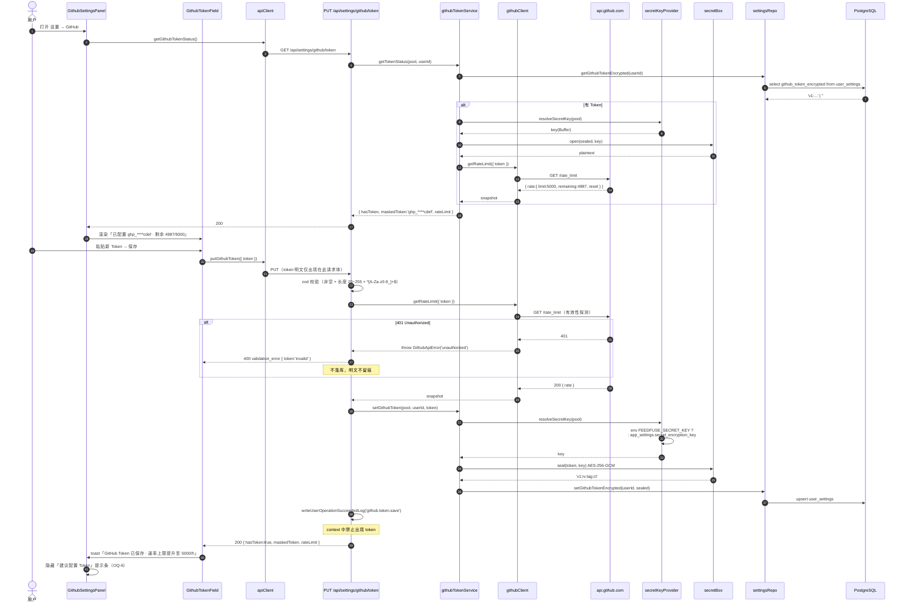
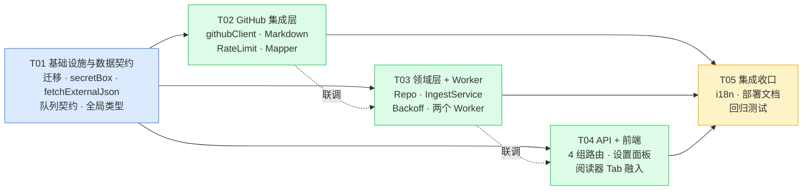

# 架构设计: GitHub 模块 (FeedFuse)

> **版本**: v1.0 | **日期**: 2026-08-04 | **作者**: Architect (高见远)
> **上游输入**: `docs/prd-github-module.md` (v0.1)、`docs/ui-style-guide.md` (v0.1)
> **状态**: Ready for Implementation
> **目标范围**: MVP = R01 / R02 / R03 / R04 / R05（仅 Release 类型）
> **重要裁决**: 数据模型见 ADR-01（推翻 PRD 独立表方案）；视觉规范见 §6.1（MVP 不参与视觉改版）

---

## 0. 摘要与核心架构决策

本设计的核心判断是：**GitHub 不应该是一套平行的数据/渲染体系，而应该成为 `feeds` 表上的第三种 `kind`**。

FeedFuse 现有代码库已经有两个可直接照搬的先例：

| 先例 | 机制 | 与 GitHub 的相似度 |
|------|------|-------------------|
| **AI 智能报告** (`kind = 'ai_digest'`) | 在 `feeds` 上开一个非 RSS 的 kind，用 `ai_digest_configs`（`feed_id` 为主键）挂配置，产物写进 `articles` | ★★★★★ 结构完全同构 |
| **Fever 同步** (`provider = 'fever'`) | 外部 HTTP API 拉取 → 投影进本地 `feeds`/`articles`，独立 Worker 队列 + 独立 tick 调度 | ★★★★★ 数据流完全同构 |

因此本设计 **推翻 PRD 3.5 节「独立 `github_subscriptions` / `github_articles` 表」的方案**，改为复用 `feeds` / `articles`。详细论证见 ADR-01。

### 架构决策记录（ADR）总览

| # | 决策 | 结论 | PRD 原方案 |
|---|------|------|-----------|
| ADR-01 | 数据模型是否独立建表 | **复用 `feeds`/`articles`**，新增 `kind='github'` + 两张 1:1 挂载表 | ❌ 推翻（PRD 建议独立表） |
| ADR-02 | AI 摘要存储 | 复用 `article_ai_summary_sessions`，**不建 `github_article_summaries`** | ❌ 推翻 |
| ADR-03 | 文章列表 API | **不建 `/api/github/articles`**，复用 `/api/reader/snapshot` | ❌ 推翻 |
| ADR-04 | 左栏归属 | GitHub 独立 Tab（对标「智能报告」），**不混入「全部」** | ⚠️ 调整（PRD OQ-5 建议混排） |
| ADR-05 | Worker 队列 | 新增 `github.sync_due`（tick）+ `github.fetch_repo`（单仓库），对标 Fever 双队列 | ✅ 对齐 |
| ADR-06 | Token 加密 | 新增 `secretBox` (AES-256-GCM) 基础设施，密钥来自 env 优先 / DB 自动生成兜底；**env 格式错误在启动期直接失败、绝不静默回落 DB** | ✅ 对齐（T01 已落地） |
| ADR-07 | Markdown 渲染 | GitHub `body_html`（`full+json` 媒体类型）优先，`marked` 本地渲染兜底 | ➕ 补充（PRD 未涉及） |
| ADR-08 | `content_types` 存储类型 | 用 `text[]` 而非 `JSONB`（与 `filtered_by`、`selected_feed_ids` 一致） | ⚠️ 微调 |

### MVP 收益量化

复用现有表带来的**直接省掉的工作量**：

| 能力 | 独立表方案需要重写 | 复用方案 |
|------|-----------------|---------|
| 三栏列表 / 游标分页 / 未读计数 | `readerSnapshotService` 全量分支（535 行） | 加 1 个 `if` 分支 |
| 已读 / 收藏 / 标记全部已读 | 新 API + 新 store 分支 | 0 改动 |
| 全局搜索 | 新增 union 查询 | 0 改动 |
| 高亮 / 标签 / 收藏板 / 知识库索引 | 4 套外键与 API 重做 | 0 改动 |
| AI 摘要 / 翻译（R11） | 新 worker + 新表 + 新 SSE 通道 | 0 改动（直接命中现有 pipeline） |
| 刷新 Run 追踪（R05） | 新表 | 复用 `feed_refresh_runs` |

---

## 1. 实现方案与框架选型

### 1.1 技术难点分析

| # | 难点 | 影响 | 应对策略 |
|---|------|------|---------|
| D1 | **GitHub API 速率限制**：匿名 60 req/h，Token 5000 req/h。100 个仓库 × 60min 间隔 = 100 req/h，匿名场景直接击穿 | 用户体验崩塌 / 被 403 封禁 | ① `ETag` 条件请求（304 **不计入**配额）② 读 `x-ratelimit-remaining` 主动降速 ③ 全局 `rate_limited_until` 熔断 ④ 未配 Token 时最小间隔强制 ≥ 60min |
| D2 | **Release body 是 Markdown**，而 `articles.content_html` 存 HTML | 渲染管线不兼容 | 优先取 GitHub 服务端渲染的 `body_html`；兜底用 `marked` 本地渲染；两条路径均过现有 `sanitizeContent()` |
| D3 | **Token 必须加密存储**，但现有 `ai_api_key` 是明文 | 安全合规 | 新增 `secretBox` (AES-256-GCM) 基础设施；GitHub Token 首个接入方，后续可回迁其他密钥 |
| D4 | **SSRF 防护**：现有 `externalHttpClient` 只有 `fetchRssXml`/`fetchHtml`，没有 JSON 能力 | 无法复用安全管线 | 在 `externalHttpClient` 上扩展 `fetchExternalJson()`，复用 `fetchTextWithValidatedRedirects` + `isSafeExternalUrl` + 系统日志；额外叠加 `api.github.com` 主机白名单 |
| D5 | **去重**：Release 可能被编辑后重新推送 | 重复条目 | `articles.dedupe_key = 'github:release:{release.id}'`，命中现有 `(feed_id, dedupe_key)` 唯一索引 |
| D6 | **首次订阅回填 vs 增量** | 首次订阅空列表体验差 / 全量拉取浪费配额 | 首次同步拉 1 页（`per_page=30`）；后续增量只拉第 1 页 + ETag |
| D7 | **多用户隔离** | 越权 | 所有新表带 `user_id` 并在每条 SQL 显式过滤，遵循 `normalizeUserId()` 约定 |

### 1.2 框架与库选型

| 层 | 选型 | 理由 |
|----|------|------|
| HTTP 客户端 | **复用 `got`**（经 `externalHttpClient`） | 已内建 SSRF 逐跳校验、重定向手动处理、大小限制、外部请求系统日志。不引入 `@octokit/rest`：Octokit 会绕过项目的 SSRF 网关与日志体系，且体积远大于我们实际需要的 3 个端点 |
| 参数校验 | **复用 `zod` v4** | 与所有现有 API route 一致 |
| 队列 | **复用 `pg-boss` v12** | 复用 `QUEUE_CONTRACTS` 声明式契约 + `registerWorkers` |
| 数据访问 | **复用 `pg` Pool + Repository 函数** | 项目无 ORM，保持裸 SQL + 显式列别名风格 |
| Markdown | **新增 `marked`**（兜底渲染） | 唯一新增运行时依赖，MIT，零传递依赖，可离线单测 |
| HTML 消毒 | **复用 `sanitize-html`**（经 `sanitizeContent`） | 与 RSS 正文同一条消毒管线，避免出现第二套 XSS 风险面 |
| 加密 | **`node:crypto` 内置**（AES-256-GCM） | 不引入依赖 |
| 状态管理 | **复用 `zustand` `useAppStore`** | GitHub 条目就是 `Article`，天然进现有 store |
| UI | **复用 Radix UI + Tailwind 4 + `lucide-react`** | `Github` 图标 lucide 已内置 |

### 1.3 与现有架构的融合视图



> ★ = 复用现有模块（零改动或极小改动） ➕ = 本次新增

### 1.4 ADR-01 详述：为什么不建独立表（关键决策）

PRD 3.5 节的论据是「GitHub 条目字段语义差异较大」。但从代码库实际情况看，这个论据不成立：

**（a）`feeds` 表已经是「多态订阅源」抽象，不是「RSS 表」**

```sql
-- 0019_ai_digest_sources.sql
alter table feeds add column kind text not null default 'rss';
alter table feeds add constraint feeds_kind_check check (kind in ('rss', 'ai_digest'));
-- 0029_fever_sources.sql
alter table feeds add column provider text not null default 'local_rss';
```

`kind='ai_digest'` 的 feed 根本没有 RSS URL（用的是 `http://localhost/__feedfuse_ai_digest__/{id}` 合成 URL），照样跑通了整条链路。GitHub 有真实 URL（`https://github.com/{owner}/{repo}`），比 ai_digest 更"合法"。

**（b）抓取链路本来就按 kind/provider 分流，不会误抓**

```ts
// feedsRepo.listEnabledFeedsForFetch —— 只有 rss + local_rss 进 RSS 抓取队列
where enabled = true and kind = 'rss' and provider = 'local_rss'
```
新增 `kind='github'` **天然被排除在 RSS 抓取之外**，零回归风险。

**（c）阅读器查询本来就按 kind 过滤，GitHub 接入只需加一个分支**

```ts
// readerSnapshotService.buildArticleFilter —— 现状
if (input.view === AI_DIGEST_VIEW_ID) {
  whereParts.push("feed_id in (select id from feeds where user_id = $1 and kind = 'ai_digest')");
}
if (isRssSmartView(input.view)) {
  whereParts.push("feed_id in (select id from feeds where user_id = $1 and kind = 'rss')");
}
```
加一个 `GITHUB_VIEW_ID` 分支即可，且 `all/unread/starred` 的 `kind='rss'` 约束会自动把 GitHub 条目挡在 RSS 视图外——**不会污染现有列表**。

**（d）独立表的隐性成本被 PRD 严重低估**

`articles.id` 是全站的中心外键，被 **9 张表**引用：`article_tasks`、`article_ai_summary_sessions`、`article_translation_sessions/segments/events`、`article_media_attachments`、`article_highlights`、`article_tags`、`board_items`、`ai_digest_run_sources`、`fever_item_mappings`、`knowledge_embeddings`。走独立表意味着这些能力对 GitHub 条目**全部失效**，或者每一张都要加一列 `github_article_id` + 一堆 `CHECK (article_id is not null or github_article_id is not null)`。

**结论**：复用 `feeds` / `articles`，GitHub 特有字段用 1:1 挂载表承载（与 `ai_digest_configs` 完全同构）。

### 1.5 ADR-04 详述：GitHub 独立 Tab 而非混排

PRD OQ-5 建议「MVP 混合展示」。本设计**调整为独立 Tab**，理由：

1. **一致性**：`ai_digest` 已经走的是独立 Tab（`FEED_VIEW_TAB_ITEMS` 里的「智能报告」），GitHub 混排会产生两套心智模型。
2. **零回归**：混排要动 `isRssSmartView` 的 `kind='rss'` 硬约束，直接影响所有存量用户的「全部/未读/收藏」列表与未读计数。
3. **PRD 自洽**：PRD 3.3 信息架构图本身就把 GitHub 画成左栏的独立分组。
4. **可演进**：P1 只需加一个设置开关，把 `kind = 'rss'` 放宽成 `kind = any('{rss,github}')` 即可实现混排，成本 < 20 行。

---

## 2. 文件列表

图例：➕ 新建 ✏️ 修改 ★ 零改动复用

### 2.1 数据库迁移

| 文件 | 状态 | 作用 |
|------|------|------|
| `src/server/infra/db/migrations/0045_github_module.sql` | ➕ | 扩展 `feeds_kind_check` / `feeds_view_check`；建 `github_repo_subscriptions`、`github_article_items`；加 `user_settings.github_token_encrypted`、`app_settings.secret_encryption_key` |

### 2.2 基础设施层 `src/server/infra/`

| 文件 | 状态 | 作用 |
|------|------|------|
| `infra/crypto/secretBox.ts` | ➕ | AES-256-GCM 对称加密，`seal()` / `open()` / `isSealed()`，密文格式 `v1:iv:tag:ct` |
| `infra/crypto/secretKeyProvider.ts` | ➕ | 密钥解析：env `FEEDFUSE_SECRET_KEY` 优先 → `app_settings.secret_encryption_key` 兜底；**env 格式错误在启动期直接失败、绝不静默回落 DB**（防用错密钥加密致后续无法解密），带进程内缓存 |
| `infra/http/externalHttpClient.ts` | ✏️ | 新增导出 `fetchExternalJson<T>()`，复用逐跳 SSRF 校验 + 大小限制 + `writeExternalRequestLog` |
| `infra/queue/jobs.ts` | ✏️ | 新增 `JOB_GITHUB_SYNC_DUE = 'github.sync_due'`、`JOB_GITHUB_FETCH_REPO = 'github.fetch_repo'` |
| `infra/queue/contracts.ts` | ✏️ | 新增两条队列契约；`SendContext` 增加 `feedId`（已存在，无需改）|
| `infra/env.ts` | ✏️ | 解析 `FEEDFUSE_SECRET_KEY`、`GITHUB_API_BASE_URL`（默认 `https://api.github.com`）、`GITHUB_USER_AGENT` |

### 2.3 外部集成层 `src/server/integrations/github/`

| 文件 | 状态 | 作用 |
|------|------|------|
| `integrations/github/githubClient.ts` | ➕ | GitHub REST 封装：`getRepository()` / `listReleases()`，负责 Auth header、ETag、媒体类型、主机白名单 |
| `integrations/github/githubRateLimit.ts` | ➕ | 解析 `x-ratelimit-*` / `retry-after`，计算熔断到期时间与退避间隔 |
| `integrations/github/githubErrors.ts` | ➕ | `GithubApiError`（含 `status`/`kind`），`kind ∈ not_found｜unauthorized｜rate_limited｜forbidden｜network｜invalid_response` |
| `integrations/github/githubMarkdown.ts` | ➕ | `renderReleaseBody()`：`body_html` 优先 → `marked` 兜底 → `sanitizeContent()` 收口 |
| `integrations/github/githubResourceMapper.ts` | ➕ | `parseRepoInput()`（URL / `owner/repo` / `git@` 归一化）、`buildReleaseDedupeKey()`、`toArticleDraft()` |
| `integrations/github/githubSchemas.ts` | ➕ | zod schema 校验 GitHub 响应（`repositorySchema` / `releaseSchema`），防御字段缺失 |

### 2.4 领域层 `src/server/domains/github/`

| 文件 | 状态 | 作用 |
|------|------|------|
| `domains/github/types.ts` | ➕ | 领域内共享类型（`GithubContentType`、`GithubSubscriptionRow`、`GithubReleaseDraft` 等）|
| `domains/github/repositories/githubSubscriptionsRepo.ts` | ➕ | 订阅 CRUD、`listDueSubscriptions()`、`recordSyncResult()`、`recordRateLimit()` |
| `domains/github/repositories/githubArticleItemsRepo.ts` | ➕ | `github_article_items` 写入与按 articleId/feedId 查询 |
| `domains/github/services/githubSubscriptionLifecycleService.ts` | ➕ | 「建 feed + 建订阅 + 解析分类」事务编排，对标 `aiDigestLifecycleService` |
| `domains/github/services/githubIngestService.ts` | ➕ | **核心**：单仓库同步（取 Token → 调 API → 映射 → 落库 → 记录状态/退避）|
| `domains/github/services/githubTokenService.ts` | ➕ | Token 读写（加解密）、`hasToken()`、`maskToken()`、Token 有效性探测 |
| `domains/github/tasks/githubFetchErrorMapping.ts` | ➕ | 错误 → `{errorCode, errorMessage(中文), rawErrorMessage}`，对标 `feedFetchErrorMapping` |
| `domains/github/tasks/githubBackoff.ts` | ➕ | `computeNextSyncAt()`：正常间隔 / 指数退避 / 限流熔断三态 |
| `domains/settings/repositories/settingsRepo.ts` | ✏️ | 新增 `getGithubTokenEncrypted()` / `setGithubTokenEncrypted()` / `clearGithubToken()` |
| `domains/feeds/repositories/feedsRepo.ts` | ✏️ | `FeedKind` 加 `'github'`；新增 `createGithubFeed()`（对标 `createAiDigestFeed`）|
| `domains/reader/services/readerSnapshotService.ts` | ✏️ | `buildArticleFilter` 增加 `GITHUB_VIEW_ID` 分支 |

### 2.5 Worker 层 `src/worker/`

| 文件 | 状态 | 作用 |
|------|------|------|
| `worker/githubSyncDue.ts` | ➕ | tick：扫描 `next_sync_at <= now()` 的订阅并投递 `github.fetch_repo`（对标 `feverAutoSync.ts`）|
| `worker/githubFetchWorker.ts` | ➕ | 单仓库同步 handler 主体，调用 `githubIngestService` |
| `worker/index.ts` | ✏️ | 注册两个 handler；`boss.schedule('github.sync_due','* * * * *')`；`enqueueRefreshAll` 的 `force` 分支并入 GitHub 目标 |

### 2.6 API 路由 `src/app/api/`

| 文件 | 状态 | 作用 |
|------|------|------|
| `app/api/github/repos/route.ts` | ➕ | `GET` 列表（含状态）/ `POST` 添加订阅（校验仓库存在性）|
| `app/api/github/repos/[id]/route.ts` | ➕ | `PATCH` 更新（间隔、启用、contentTypes、分类、预发布开关）/ `DELETE` 删除 |
| `app/api/github/repos/[id]/refresh/route.ts` | ➕ | `POST` 手动刷新（投递 `github.fetch_repo` + `force`）|
| `app/api/settings/github/token/route.ts` | ➕ | `GET` 状态（`hasToken`/`maskedToken`/`rateLimit`）/ `PUT` 保存 / `DELETE` 清除 |
| `app/api/reader/snapshot/route.ts` | ★ | 零改动，GitHub 条目自动进入 |
| `app/api/articles/**` | ★ | 已读/收藏/AI 摘要/翻译全部零改动 |

### 2.7 前端 `src/`

| 文件 | 状态 | 作用 |
|------|------|------|
| `types/index.ts` | ✏️ | `FeedKind` 加 `'github'`；`FeedContentView` 加 `'github'`；`SystemLogCategory` 加 `'github'`；新增 `GithubRepoSubscription`、`GithubTokenStatus`、`GithubArticleMeta` |
| `lib/reader/view.ts` | ✏️ | 导出 `GITHUB_VIEW_ID = 'github'`；纳入 `isAggregateView()` |
| `lib/feeds/feedIcons.ts` | ✏️ | 导出 `GITHUB_ICON_URL = '/github-icon.svg'` 作为无 avatar 时的兜底 |
| `lib/api/apiClient.ts` | ✏️ | 新增 `listGithubRepos` / `createGithubRepo` / `patchGithubRepo` / `deleteGithubRepo` / `refreshGithubRepo` / `getGithubTokenStatus` / `putGithubToken` / `deleteGithubToken` |
| `lib/userOperationCatalog.ts` | ✏️ | 新增 action key：`github.repo.create/update/delete/refresh`、`github.token.save/clear` |
| `features/github/components/GithubRepoDialog.tsx` | ➕ | 添加/编辑仓库对话框（Radix Dialog，对标 `AddAiDigestDialog`）|
| `features/github/components/GithubRepoList.tsx` | ➕ | 设置页已订阅仓库卡片列表（avatar + owner/repo + 状态 badge + 操作）|
| `features/github/components/GithubTokenField.tsx` | ➕ | Token 输入/保存/清除 + 速率限制提示 |
| `features/github/components/GithubStatusBadge.tsx` | ➕ | 刷新状态 badge：正常 / 同步中 / 限流中 / 失败（R05）|
| `features/github/components/GithubTypeBadge.tsx` | ➕ | 中栏条目类型 badge `[Release]`（PRD 3.4 配色）|
| `features/github/hooks/useGithubRepos.ts` | ➕ | 订阅列表加载/增删改/轮询状态 |
| `features/github/utils/repoInput.ts` | ➕ | 前端侧 `owner/repo` 输入解析与即时校验（与后端 `parseRepoInput` 同规则）|
| `features/settings/panels/GithubSettingsPanel.tsx` | ➕ | 设置中心「GitHub」分区（Token + 仓库列表 + 添加入口）|
| `features/settings/components/SettingsCenterDrawer.tsx` | ✏️ | `sectionItems` 加 `{ key:'github', label:'GitHub', icon: Github }` 并挂载面板 |
| `features/feeds/components/FeedViewTabs.tsx` | ✏️ | 加 GitHub Tab；`getContentViewForTab` / `getTabForContentView` 映射 |
| `features/feeds/components/FeedList.tsx` | ✏️ | `viewTabCounts` 加 `kind==='github'` 分支；`visibleFeeds` 加 GitHub 过滤 |
| `features/feeds/components/FeedListHeader.tsx` | ✏️ | 「+」菜单加「添加 GitHub 仓库」入口 |
| `features/articles/components/ArticleListItem.tsx`（按实际文件名） | ✏️ | GitHub 条目渲染 `GithubTypeBadge` |
| `public/github-icon.svg` | ➕ | 兜底图标 |

### 2.8 测试 `src/test/`

| 文件 | 状态 |
|------|------|
| `test/server/integrations/github/githubClient.test.ts` | ➕ |
| `test/server/integrations/github/githubResourceMapper.test.ts` | ➕ |
| `test/server/integrations/github/githubMarkdown.test.ts` | ➕ |
| `test/server/github/githubIngestService.test.ts` | ➕ |
| `test/server/github/githubBackoff.test.ts` | ➕ |
| `test/server/crypto/secretBox.test.ts` | ➕ |
| `test/app/api/github/repos/route.test.ts` | ➕ |
| `test/app/api/settings/github/token/route.test.ts` | ➕ |
| `test/features/settings/githubSettingsPanel.test.tsx` | ➕ |
| `test/worker/githubFetchWorker.test.ts` | ➕ |

---

## 3. 数据结构与接口

### 3.1 数据库 DDL（`0045_github_module.sql`）

```sql
-- ============================================================
-- 0045_github_module.sql —— GitHub 模块 MVP
-- 设计原则：复用 feeds/articles，GitHub 专属字段用 1:1 挂载表承载
-- ============================================================

-- (1) feeds.kind 扩展：rss | ai_digest | github
alter table feeds drop constraint if exists feeds_kind_check;
alter table feeds
  add constraint feeds_kind_check check (kind in ('rss', 'ai_digest', 'github'));

-- (2) feeds.view 扩展（左栏 Tab 归类，沿用 ai_digest 的 view='digest' 模式）
alter table feeds drop constraint if exists feeds_view_check;
alter table feeds
  add constraint feeds_view_check
  check (view in ('article', 'picture', 'video', 'social', 'digest', 'github'));

-- (3) GitHub 仓库订阅配置（1:1 挂在 feeds 上，对标 ai_digest_configs）
create table if not exists github_repo_subscriptions (
  feed_id                   bigint primary key references feeds(id) on delete cascade,
  user_id                   bigint not null references users(id) on delete cascade,

  -- 仓库标识
  owner                     text   not null,
  repo                      text   not null,
  repo_html_url             text   not null,

  -- 订阅配置
  content_types             text[] not null default '{release}',
  include_prerelease        boolean not null default false,

  -- 仓库元信息快照（发现页/列表展示用，同步时刷新）
  repo_description          text   null,
  repo_language             text   null,
  repo_stargazers           int    null,
  repo_avatar_url           text   null,
  repo_metadata_synced_at   timestamptz null,

  -- 增量抓取状态
  releases_etag             text   null,
  last_release_published_at timestamptz null,

  -- 调度与健康状态（R05）
  last_synced_at            timestamptz null,   -- 上次成功
  last_sync_attempt_at      timestamptz null,   -- 上次尝试
  next_sync_at              timestamptz null,   -- 下次计划
  consecutive_failures      int    not null default 0,
  rate_limited_until        timestamptz null,
  rate_limit_remaining      int    null,
  last_error_code           text   null,
  last_error                text   null,
  last_raw_error            text   null,

  created_at                timestamptz not null default now(),
  updated_at                timestamptz not null default now(),

  constraint github_repo_subscriptions_content_types_check
    check (
      content_types <@ array['release','issue','pr','commit']::text[]
      and coalesce(array_length(content_types, 1), 0) >= 1
    ),
  constraint github_repo_subscriptions_failures_non_negative
    check (consecutive_failures >= 0)
);

-- 同一用户同一仓库只能订阅一次（大小写不敏感，与 categories_name_unique 同风格）
create unique index if not exists github_repo_subscriptions_user_repo_unique
  on github_repo_subscriptions (user_id, lower(owner), lower(repo));

-- Worker tick 扫描路径：where next_sync_at <= now() order by next_sync_at
create index if not exists github_repo_subscriptions_due_idx
  on github_repo_subscriptions (next_sync_at asc nulls first);

create index if not exists github_repo_subscriptions_user_idx
  on github_repo_subscriptions (user_id);

-- (4) GitHub 条目扩展（1:1 挂在 articles 上）
create table if not exists github_article_items (
  article_id     bigint primary key references articles(id) on delete cascade,
  user_id        bigint not null references users(id) on delete cascade,
  feed_id        bigint not null references feeds(id) on delete cascade,

  gh_type        text   not null,          -- release | issue | pr | commit
  gh_id          text   not null,          -- GitHub 数字 id（字符串存储）
  gh_node_id     text   null,              -- GraphQL node_id，便于 P1 迁移
  gh_number      int    null,              -- issue / pr 编号（release 为 null）

  tag_name       text   null,              -- Release tag，如 v19.0.0
  is_prerelease  boolean not null default false,
  is_draft       boolean not null default false,
  body_markdown  text   null,              -- 原始 Markdown，供 P1 重渲染 / AI 摘要
  html_url       text   not null,

  created_at     timestamptz not null default now(),

  constraint github_article_items_gh_type_check
    check (gh_type in ('release', 'issue', 'pr', 'commit'))
);

create index if not exists github_article_items_feed_type_idx
  on github_article_items (feed_id, gh_type);

create unique index if not exists github_article_items_feed_type_ghid_unique
  on github_article_items (feed_id, gh_type, gh_id);

-- 注：gh_node_id / gh_number / is_draft 为 T01 刻意保留的「前向兼容列」，
--    MVP 仅写 release，但便于 P1 免迁移扩展 issue / pr / draft。
-- (5) GitHub Token 加密存储
alter table user_settings
  add column if not exists github_token_encrypted text not null default '';

-- (6) 应用级密钥（env FEEDFUSE_SECRET_KEY 缺省时的兜底密钥源）
alter table app_settings
  add column if not exists secret_encryption_key text not null default '';

update app_settings
set secret_encryption_key = encode(gen_random_bytes(32), 'hex')
where id = 1 and coalesce(secret_encryption_key, '') = '';
```

> **迁移安全性**：全部为 `add column if not exists` / 索引新建 / CHECK 放宽（`drop constraint if exists` + 重建为更宽集合），**不存在收紧型变更**，对存量数据零影响，可安全回滚（回滚只需 drop 新表 + 恢复窄 CHECK）。

#### 与 PRD 3.5 的字段映射对照

| PRD 字段 | 本设计落点 |
|---------|-----------|
| `github_subscriptions.id` | `feeds.id`（feed_id 即订阅 id） |
| `github_subscriptions.user_id` | `feeds.user_id` + `github_repo_subscriptions.user_id`（冗余，便于单表查询） |
| `github_subscriptions.owner/repo` | `github_repo_subscriptions.owner/repo` |
| `github_subscriptions.content_types` | `github_repo_subscriptions.content_types` (`text[]`) |
| `github_subscriptions.refresh_interval_minutes` | `feeds.fetch_interval_minutes` ★复用 |
| `github_subscriptions.is_enabled` | `feeds.enabled` ★复用 |
| `github_subscriptions.last_fetched_at` | `github_repo_subscriptions.last_synced_at` |
| `github_subscriptions.next_fetch_at` | `github_repo_subscriptions.next_sync_at` |
| `github_subscriptions.error_message` | `feeds.last_fetch_error`（UI 复用）+ `github_repo_subscriptions.last_error`（细节） |
| `github_articles.id` | `articles.id` ★复用 |
| `github_articles.gh_type` / `gh_id` | `github_article_items.gh_type` / `gh_id` |
| `github_articles.title` | `articles.title` ★复用 |
| `github_articles.body` | `articles.content_html`（渲染后）+ `github_article_items.body_markdown`（原文） |
| `github_articles.author` | `articles.author` ★复用 |
| `github_articles.url` | `articles.link` ★复用 |
| `github_articles.tags` | `github_article_items.tag_name` + 现有 `article_tags` 体系 |
| `github_articles.published_at` | `articles.published_at` ★复用 |
| `github_articles.is_read` | `articles.is_read` ★复用 |
| `github_article_summaries.*` | `article_ai_summary_sessions` ★复用（ADR-02） |

### 3.2 核心类型与类图

```mermaid
classDiagram
    direction LR

    %% ============ 领域类型 ============
    class GithubContentType {
        <<type>>
        release, issue, pr, commit
    }

    class GithubRepoSubscriptionRow {
        +string feedId
        +string userId
        +string owner
        +string repo
        +string repoHtmlUrl
        +GithubContentType[] contentTypes
        +boolean includePrerelease
        +string|null repoDescription
        +string|null repoLanguage
        +number|null repoStargazers
        +string|null repoAvatarUrl
        +string|null releasesEtag
        +string|null lastReleasePublishedAt
        +string|null lastSyncedAt
        +string|null lastSyncAttemptAt
        +string|null nextSyncAt
        +number consecutiveFailures
        +string|null rateLimitedUntil
        +number|null rateLimitRemaining
        +string|null lastErrorCode
        +string|null lastError
    }

    class GithubSubscriptionView {
        <<DTO>>
        +string id
        +string feedId
        +string owner
        +string repo
        +string fullName
        +string title
        +boolean enabled
        +number fetchIntervalMinutes
        +string|null categoryId
        +GithubSyncStatus status
        +number unreadCount
    }

    class GithubSyncStatus {
        <<type>>
        idle, syncing, rate_limited, error
    }

    class GithubArticleItemRow {
        +string articleId
        +string userId
        +string feedId
        +GithubContentType ghType
        +string ghId
        +string|null ghNodeId
        +number|null ghNumber
        +string|null tagName
        +boolean isPrerelease
        +boolean isDraft
        +string|null bodyMarkdown
        +string htmlUrl
    }

    class GithubReleaseDraft {
        <<value object>>
        +string ghId
        +string dedupeKey
        +string title
        +string|null tagName
        +string|null author
        +string publishedAt
        +string contentHtml
        +string bodyMarkdown
        +string htmlUrl
        +boolean isPrerelease
        +boolean isDraft
    }

    %% ============ 集成层 ============
    class GithubClient {
        <<module>>
        +getRepository(input) Promise~GithubRepository~
        +listReleases(input) Promise~GithubReleasesResult~
        -buildHeaders(token, etag) Record
        -assertAllowedHost(url) void
    }

    class GithubReleasesResult {
        +number status
        +GithubRelease[] releases
        +string|null etag
        +GithubRateLimitSnapshot rateLimit
    }

    class GithubRateLimitSnapshot {
        +number|null limit
        +number|null remaining
        +Date|null resetAt
        +number|null retryAfterSeconds
    }

    class GithubRateLimit {
        <<module>>
        +parseRateLimitHeaders(headers) GithubRateLimitSnapshot
        +isRateLimited(status, snapshot) boolean
        +resolveRateLimitedUntil(snapshot, now) Date
    }

    class GithubMarkdown {
        <<module>>
        +renderReleaseBody(input) string
    }

    class GithubResourceMapper {
        <<module>>
        +parseRepoInput(raw) ParsedRepoRef
        +buildReleaseDedupeKey(releaseId) string
        +toReleaseDraft(release, ctx) GithubReleaseDraft
        +buildReleaseTitle(release) string
    }

    class ParsedRepoRef {
        +string owner
        +string repo
        +string fullName
        +string htmlUrl
    }

    class GithubApiError {
        <<Error>>
        +number|null status
        +GithubApiErrorKind kind
        +GithubRateLimitSnapshot|null rateLimit
    }

    %% ============ 领域服务 ============
    class GithubSubscriptionsRepo {
        <<module>>
        +createSubscription(db, input) Promise~Row~
        +getSubscriptionByFeedId(db, feedId, userId) Promise~NullableRow~
        +findSubscriptionByRepo(db, owner, repo, userId) Promise~NullableRow~
        +listSubscriptionsByUser(db, userId) Promise~Row[]~
        +listDueSubscriptions(db, now, limit) Promise~DueRow[]~
        +updateSubscriptionConfig(db, feedId, patch, userId) Promise~Row~
        +recordSyncResult(db, feedId, result) Promise~void~
        +recordRepoMetadata(db, feedId, metadata) Promise~void~
        +deleteSubscription(db, feedId, userId) Promise~void~
    }

    class GithubArticleItemsRepo {
        <<module>>
        +insertArticleItem(db, input) Promise~void~
        +getByArticleId(db, articleId, userId) Promise~NullableRow~
        +listByArticleIds(db, ids, userId) Promise~Row[]~
    }

    class GithubTokenService {
        <<module>>
        +getGithubToken(pool, userId) Promise~string~
        +setGithubToken(pool, userId, token) Promise~void~
        +clearGithubToken(pool, userId) Promise~void~
        +getTokenStatus(pool, userId) Promise~GithubTokenStatus~
        +maskToken(token) string
    }

    class GithubSubscriptionLifecycleService {
        <<module>>
        +createGithubSubscription(pool, input) Promise~GithubSubscriptionView~
        +updateGithubSubscription(pool, feedId, patch, userId) Promise~View~
        +deleteGithubSubscription(pool, feedId, userId) Promise~void~
    }

    class GithubIngestService {
        <<module>>
        +syncRepository(input) Promise~GithubSyncResult~
    }

    class GithubSyncResult {
        +number inserted
        +number skipped
        +boolean notModified
        +string|null errorCode
        +string|null errorMessage
        +Date nextSyncAt
    }

    class GithubBackoff {
        <<module>>
        +computeNextSyncAt(input) Date
    }

    class GithubFetchErrorMapping {
        <<module>>
        +mapGithubFetchError(err) MappedError
    }

    %% ============ 复用的现有模块 ============
    class FeedsRepo {
        <<existing>>
        +createGithubFeed(db, input) Promise~FeedRow~
        +updateFeed(db, id, patch, userId)
        +recordFeedFetchResult(db, id, result)
    }

    class ArticlesRepo {
        <<existing>>
        +insertArticleIgnoreDuplicate(db, input) Promise~NullableArticleRow~
    }

    class ExternalHttpClient {
        <<existing + extended>>
        +fetchExternalJson(url, options) Promise~FetchJsonResult~
        +fetchRssXml(url, options)
    }

    class SecretBox {
        <<new infra>>
        +seal(plaintext, key) string
        +open(sealed, key) string
        +isSealed(value) boolean
    }

    %% ============ Worker ============
    class GithubSyncDueWorker {
        <<worker>>
        +runGithubSyncDue(input) Promise~EnqueueSummary~
    }

    class GithubFetchWorker {
        <<worker>>
        +runGithubFetchWorker(input) Promise~void~
    }

    %% ============ 关系 ============
    GithubRepoSubscriptionRow "1" --> "1..*" GithubContentType : contentTypes
    GithubSubscriptionView --> GithubSyncStatus : status
    GithubSubscriptionsRepo ..> GithubRepoSubscriptionRow : returns
    GithubArticleItemsRepo ..> GithubArticleItemRow : returns

    GithubClient ..> GithubReleasesResult : returns
    GithubClient ..> GithubApiError : throws
    GithubClient --> ExternalHttpClient : uses
    GithubClient --> GithubRateLimit : uses
    GithubReleasesResult --> GithubRateLimitSnapshot
    GithubResourceMapper ..> ParsedRepoRef : returns
    GithubResourceMapper ..> GithubReleaseDraft : returns
    GithubResourceMapper --> GithubMarkdown : uses

    GithubIngestService --> GithubClient : uses
    GithubIngestService --> GithubResourceMapper : uses
    GithubIngestService --> GithubTokenService : uses
    GithubIngestService --> GithubSubscriptionsRepo : uses
    GithubIngestService --> GithubArticleItemsRepo : uses
    GithubIngestService --> ArticlesRepo : uses
    GithubIngestService --> FeedsRepo : uses
    GithubIngestService --> GithubBackoff : uses
    GithubIngestService --> GithubFetchErrorMapping : uses
    GithubIngestService ..> GithubSyncResult : returns

    GithubSubscriptionLifecycleService --> FeedsRepo : uses
    GithubSubscriptionLifecycleService --> GithubSubscriptionsRepo : uses
    GithubSubscriptionLifecycleService --> GithubClient : validates repo
    GithubSubscriptionLifecycleService ..> GithubSubscriptionView : returns

    GithubTokenService --> SecretBox : uses

    GithubSyncDueWorker --> GithubSubscriptionsRepo : listDueSubscriptions
    GithubFetchWorker --> GithubIngestService : delegates
```



### 3.3 关键 TypeScript 类型定义

```ts
// ── src/types/index.ts（扩展）─────────────────────────────
export type FeedKind = 'rss' | 'ai_digest' | 'github';
export type FeedContentView =
  | 'article' | 'picture' | 'video' | 'social' | 'digest' | 'github';
export type SystemLogCategory =
  | 'feed' | 'category' | 'article' | 'opml' | 'settings'
  | 'external_api' | 'ai_summary' | 'ai_translate' | 'ai_digest'
  | 'github';                                   // ➕

export type GithubContentType = 'release' | 'issue' | 'pr' | 'commit';
export type GithubSyncStatus = 'idle' | 'syncing' | 'rate_limited' | 'error';

/** 设置页仓库卡片使用的前端模型 */
export interface GithubRepoSubscription {
  id: string;                 // === feedId
  feedId: string;
  owner: string;
  repo: string;
  fullName: string;           // `${owner}/${repo}`
  title: string;              // feeds.title，用户可改
  htmlUrl: string;
  avatarUrl: string | null;
  description: string | null;
  language: string | null;
  stargazers: number | null;
  contentTypes: GithubContentType[];
  includePrerelease: boolean;
  enabled: boolean;
  fetchIntervalMinutes: number;
  categoryId: string | null;
  unreadCount: number;
  status: GithubSyncStatus;
  lastSyncedAt: string | null;
  nextSyncAt: string | null;
  rateLimitedUntil: string | null;
  lastError: string | null;
  lastErrorCode: string | null;
}
// 注意：`GithubRepoSubscription` 是「feeds + github_repo_subscriptions + 计算字段」的
// 复合视图模型（非 github 表的 1:1 映射）：title / avatarUrl / description / language /
// stargazers / categoryId 来自 feeds；unreadCount / status / lastSyncedAt / nextSyncAt /
// rateLimitedUntil 为实时计算字段。T01 已按此落地，前端直接消费该类型即可。

export interface GithubTokenStatus {
  hasToken: boolean;
  maskedToken: string | null;   // 形如 "ghp_****cdef"，永不返回明文
  rateLimit: {
    limit: number | null;
    remaining: number | null;
    resetAt: string | null;
  } | null;
}

/** 中栏/右栏渲染 GitHub 条目所需的附加信息 */
export interface GithubArticleMeta {
  ghType: GithubContentType;
  tagName: string | null;
  isPrerelease: boolean;
  htmlUrl: string;
}
```

```ts
// ── src/server/integrations/github/githubClient.ts ────────
export interface GithubRequestContext {
  token: string | null;          // 空串/null → 匿名
  userId: string;
  timeoutMs?: number;
}

export interface GithubRepository {
  id: number;
  nodeId: string;
  owner: string;
  repo: string;
  fullName: string;
  htmlUrl: string;
  description: string | null;
  language: string | null;
  stargazersCount: number;
  avatarUrl: string | null;
  archived: boolean;
  isPrivate: boolean;
}

export interface GithubRelease {
  id: number;
  nodeId: string;
  tagName: string;
  name: string | null;
  body: string | null;
  bodyHtml: string | null;       // full+json 媒体类型返回
  htmlUrl: string;
  draft: boolean;
  prerelease: boolean;
  authorLogin: string | null;
  publishedAt: string | null;
  createdAt: string;
}

export interface GithubRateLimitSnapshot {
  limit: number | null;
  remaining: number | null;
  resetAt: Date | null;
  retryAfterSeconds: number | null;
}

export interface GithubReleasesResult {
  status: number;                // 200 | 304
  releases: GithubRelease[];     // 304 时为空数组
  etag: string | null;
  rateLimit: GithubRateLimitSnapshot;
}

export type GithubApiErrorKind =
  | 'not_found'        // 404：仓库不存在或私有且无权限
  | 'unauthorized'     // 401：Token 无效/过期
  | 'forbidden'        // 403 非限流：SSO / 权限不足
  | 'rate_limited'     // 403 + remaining=0 或 429
  | 'network'          // 超时 / DNS / SSRF 拦截
  | 'invalid_response';// schema 校验失败

export declare function getRepository(
  input: { owner: string; repo: string } & GithubRequestContext,
): Promise<GithubRepository>;

export declare function listReleases(
  input: {
    owner: string;
    repo: string;
    etag?: string | null;
    perPage?: number;   // 默认 30
  } & GithubRequestContext,
): Promise<GithubReleasesResult>;
```

```ts
// ── src/server/domains/github/services/githubIngestService.ts ──
export interface GithubSyncInput {
  pool: Pool;
  boss: Pick<PgBoss, 'send'>;
  feedId: string;
  userId: string;
  force?: boolean;
  now?: Date;
}

export interface GithubSyncResult {
  inserted: number;
  skipped: number;
  notModified: boolean;
  errorCode: string | null;
  errorMessage: string | null;
  nextSyncAt: Date;
}

export declare function syncRepository(input: GithubSyncInput): Promise<GithubSyncResult>;
```

```ts
// ── src/server/infra/crypto/secretBox.ts ──────────────────
/** 密文格式：v1:<iv_b64url>:<tag_b64url>:<ciphertext_b64url> */
export declare function seal(plaintext: string, key: Buffer): string;
export declare function open(sealed: string, key: Buffer): string;
export declare function isSealed(value: string): boolean;

// ── src/server/infra/crypto/secretKeyProvider.ts ──────────
/** 优先 env FEEDFUSE_SECRET_KEY(hex/base64, 32B)；格式错误启动期直接失败、不静默回落 DB；否则读 app_settings.secret_encryption_key */
export declare function resolveSecretKey(pool: Pool): Promise<Buffer>;
```

### 3.4 API 契约（DTO）

所有响应统一走 `ok()` / `fail()`，信封为 `{ ok: true, data: T }` 或 `{ ok: false, error: { code, message, fields? } }`。

#### `GET /api/github/repos`

```jsonc
// 200 → data
[
  {
    "id": "1024",
    "feedId": "1024",
    "owner": "vercel",
    "repo": "next.js",
    "fullName": "vercel/next.js",
    "title": "vercel/next.js",
    "htmlUrl": "https://github.com/vercel/next.js",
    "avatarUrl": "https://avatars.githubusercontent.com/u/14985020?v=4",
    "description": "The React Framework",
    "language": "JavaScript",
    "stargazers": 128000,
    "contentTypes": ["release"],
    "includePrerelease": false,
    "enabled": true,
    "fetchIntervalMinutes": 60,
    "categoryId": null,
    "unreadCount": 3,
    "status": "idle",
    "lastSyncedAt": "2026-08-04T09:00:00.000Z",
    "nextSyncAt": "2026-08-04T10:00:00.000Z",
    "rateLimitedUntil": null,
    "lastError": null,
    "lastErrorCode": null
  }
]
```

#### `POST /api/github/repos`

```ts
// Request（三种输入形态，服务端统一归一化）
const createGithubRepoBodySchema = z.object({
  // 二选一：repoInput（自由输入）或 owner+repo
  repoInput: z.string().trim().min(1).optional(),   // "vercel/next.js" | "https://github.com/vercel/next.js" | "git@github.com:vercel/next.js.git"
  owner: z.string().trim().min(1).max(100).optional(),
  repo: z.string().trim().min(1).max(100).optional(),

  title: z.string().trim().min(1).max(200).optional(),  // 默认 `${owner}/${repo}`
  contentTypes: z.array(z.enum(['release', 'issue', 'pr', 'commit'])).min(1).default(['release']),
  includePrerelease: z.boolean().default(false),
  fetchIntervalMinutes: z.number().int().min(15).max(1440).default(60),
  categoryId: numericIdSchema.nullable().optional(),
  categoryName: z.string().trim().min(1).nullable().optional(),
}).refine(v => Boolean(v.repoInput) || (Boolean(v.owner) && Boolean(v.repo)), {
  path: ['repoInput'], message: '请填写仓库地址或 owner/repo',
}).refine(v => !(v.categoryId && v.categoryName), {
  path: ['categoryName'], message: 'categoryId and categoryName are mutually exclusive',
});
```

| 状态 | code | 场景 |
|------|------|------|
| 200 | — | 创建成功，返回 `GithubRepoSubscription` |
| 400 | `validation_error` | 输入解析失败 / 仓库不存在（`fields.repoInput = 'not_found'`）/ Token 无效 |
| 409 | `conflict` | 已订阅同一仓库（`fields.repoInput = 'duplicate'`）|
| 503 | `service_unavailable` | GitHub 限流（`fields` 附 `resetAt`）|

> **MVP 约束**：`contentTypes` 仅接受 `['release']`；传入其他值时返回 `validation_error`（`fields.contentTypes = 'unsupported_in_mvp'`）。字段与约束提前落地，P1 打开即可，不需要改 schema。

#### `PATCH /api/github/repos/[id]`

```ts
const patchGithubRepoBodySchema = z.object({
  title: z.string().trim().min(1).max(200).optional(),
  enabled: z.boolean().optional(),
  fetchIntervalMinutes: z.number().int().min(15).max(1440).optional(),
  includePrerelease: z.boolean().optional(),
  contentTypes: z.array(z.enum(['release','issue','pr','commit'])).min(1).optional(),
  categoryId: numericIdSchema.nullable().optional(),
  categoryName: z.string().trim().min(1).nullable().optional(),
});
```

#### `DELETE /api/github/repos/[id]` → `data: { id }`
> 级联：`feeds` 删除 → `articles` / `github_repo_subscriptions` / `github_article_items` 全部 `on delete cascade`。

#### `POST /api/github/repos/[id]/refresh` → `data: { enqueued: true, feedId }`
> 幂等：`singletonKey = ${userId}:${feedId}`，`singletonSeconds = 30`，重复点击不会堆积。

#### `GET|PUT|DELETE /api/settings/github/token`

```ts
// PUT Request
{ "token": "ghp_xxxxxxxxxxxxxxxxxxxx" }

// Response (GET / PUT / DELETE 统一)
{
  "hasToken": true,
  "maskedToken": "ghp_****xxxx",
  "rateLimit": { "limit": 5000, "remaining": 4987, "resetAt": "2026-08-04T11:00:00.000Z" }
}
```

**安全约定**：
- 明文 Token **只在 PUT 请求体中出现一次**，落库前立即 `seal()`。
- 任何 GET/列表接口**永不返回明文**，只返回 `maskedToken`（前 4 + `****` + 后 4）。
- PUT 时同步调用 `GET https://api.github.com/rate_limit` 做有效性探测；401 → `validation_error { token: 'invalid' }`，不落库。
- Token 值**禁止**进入 `system_logs`（`writeExternalRequestLog` 只记 URL/status，Header 不落盘）。

---

## 4. 程序调用流程

### 4.1 添加仓库订阅（R01）



### 4.2 Release 抓取流程（R02 + R05）



**退避策略（`githubBackoff.computeNextSyncAt`）**

| 场景 | 下次同步时间 |
|------|------------|
| 成功 / 304 | `now + fetchIntervalMinutes`（无 Token 时下限 60min） |
| 限流（403/429） | `max(rateLimit.resetAt, now + 5min)`，并写 `rate_limited_until` |
| 失败第 n 次 | `now + min(interval × 2^n, 6h)`，`n = consecutive_failures` |
| 404（仓库已删） | `now + 24h`，且第 5 次失败后自动 `feeds.enabled = false` + 中文错误提示 |

### 4.3 阅读器加载 GitHub 条目（R03）



### 4.4 GitHub Token 配置流程（R04）



---

## 5. 依赖包

### 5.1 新增运行时依赖

| 包 | 版本 | 用途 | 体积 | 必要性 |
|----|------|------|------|--------|
| `marked` | `^16.4.1` | Release Markdown → HTML 的**兜底渲染**（GitHub `body_html` 缺失时）。零传递依赖，MIT | ~40KB | **必需** |

```bash
pnpm add marked
```

### 5.2 明确**不**引入的包及理由

| 候选 | 不引入的理由 |
|------|-------------|
| `@octokit/rest` / `octokit` | ① 会绕过项目的 `ssrfGuard` 逐跳校验与 `writeExternalRequestLog` 统一日志；② 依赖树庞大（20+ 传递依赖），MVP 只用 3 个端点；③ 自带重试策略会与 pg-boss 的退避语义冲突 |
| `markdown-it` + 插件 | 需搭配 3~4 个 GFM 插件才能对齐 `marked` 的开箱能力 |
| `dompurify` / `isomorphic-dompurify` | 项目已有 `sanitize-html` 统一消毒管线，引入第二套等于引入第二个 XSS 风险面 |
| `node-forge` / `libsodium` | `node:crypto` 的 AES-256-GCM 完全够用 |

### 5.3 新增环境变量

| 变量 | 必填 | 默认值 | 说明 |
|------|------|--------|------|
| `FEEDFUSE_SECRET_KEY` | 否（**生产强烈建议**） | 空 → 回落 `app_settings.secret_encryption_key` | 32 字节密钥，hex（64 字符）或 base64；**格式错误在启动期直接失败、绝不静默回落 DB**（防用错密钥加密致后续无法解密）。用于 Token 加密 |
| `GITHUB_API_BASE_URL` | 否 | `https://api.github.com` | 支持 GitHub Enterprise Server；变更时需同步扩展主机白名单 |
| `GITHUB_USER_AGENT` | 否 | `FeedFuse/0.4` | GitHub API 强制要求 UA |
| `GITHUB_API_TIMEOUT_MS` | 否 | `15000` | 单次 API 超时 |

> 需同步更新 `.env.example`、`docker-compose.yml`、`deploy/`、`docs/deploy.md`。

---

## 6. 任务列表（有序，含依赖）

> **共 5 个任务**。T02/T03/T04 均只依赖 T01，可并行开工；T05 收口集成。

### T01 — 基础设施与数据契约

| 项 | 内容 |
|----|------|
| **优先级** | P0 |
| **依赖** | 无 |
| **产出文件** | `src/server/infra/db/migrations/0045_github_module.sql`<br/>`src/server/infra/crypto/secretBox.ts`<br/>`src/server/infra/crypto/secretKeyProvider.ts`<br/>`src/server/infra/http/externalHttpClient.ts` ✏️（新增 `fetchExternalJson`）<br/>`src/server/infra/queue/jobs.ts` ✏️<br/>`src/server/infra/queue/contracts.ts` ✏️<br/>`src/server/infra/env.ts` ✏️<br/>`src/types/index.ts` ✏️（`FeedKind` / `FeedContentView` / `SystemLogCategory` / GitHub 类型）<br/>`src/lib/reader/view.ts` ✏️（`GITHUB_VIEW_ID`）<br/>`src/lib/feeds/feedIcons.ts` ✏️、`public/github-icon.svg`<br/>`package.json` ✏️（`marked`）、`.env.example` ✏️<br/>`src/test/server/crypto/secretBox.test.ts` |
| **验收** | ① `pnpm --filter . exec node scripts/db/migrate.mjs` 在**全新库**和**存量库**上均成功；② `seal/open` 往返测试通过，篡改密文抛错；③ `fetchExternalJson` 命中 SSRF 拦截时抛 `Unsafe URL`；④ `pnpm type-check` 通过 |
| **风险点** | `feeds_kind_check` / `feeds_view_check` 必须先 `drop constraint if exists` 再重建，否则存量库迁移失败 |

### T02 — GitHub 集成层（API 客户端 + Markdown + 映射）

| 项 | 内容 |
|----|------|
| **优先级** | P0 |
| **依赖** | T01 |
| **产出文件** | `src/server/integrations/github/githubClient.ts`<br/>`githubSchemas.ts`、`githubErrors.ts`、`githubRateLimit.ts`<br/>`githubMarkdown.ts`、`githubResourceMapper.ts`<br/>`src/test/server/integrations/github/{githubClient,githubResourceMapper,githubMarkdown}.test.ts` |
| **验收** | ① `parseRepoInput` 覆盖 `owner/repo`、`https://github.com/o/r`、`https://github.com/o/r/`、`https://github.com/o/r.git`、`git@github.com:o/r.git`、带 `?query#hash`、大小写、非法输入 7 类用例；② 200/304/403(限流)/404/401 五种响应各有单测；③ `renderReleaseBody` 对 `<script>` / `onerror=` / `javascript:` 注入全部消毒；④ 无 `body_html` 时 `marked` 兜底正确渲染代码块/列表/链接 |
| **注意** | `listReleases` 必须发 `Accept: application/vnd.github.full+json`，且**不得**在异常日志中打印 Authorization header |

### T03 — 领域层 + Worker（订阅 CRUD、同步引擎、调度）

| 项 | 内容 |
|----|------|
| **优先级** | P0 |
| **依赖** | T01（可与 T02 并行开发，联调时需 T02） |
| **产出文件** | `src/server/domains/github/types.ts`<br/>`repositories/githubSubscriptionsRepo.ts`、`repositories/githubArticleItemsRepo.ts`<br/>`services/githubSubscriptionLifecycleService.ts`、`services/githubIngestService.ts`、`services/githubTokenService.ts`<br/>`tasks/githubFetchErrorMapping.ts`、`tasks/githubBackoff.ts`<br/>`src/server/domains/feeds/repositories/feedsRepo.ts` ✏️（`FeedKind` + `createGithubFeed`）<br/>`src/server/domains/settings/repositories/settingsRepo.ts` ✏️<br/>`src/worker/githubSyncDue.ts`、`src/worker/githubFetchWorker.ts`<br/>`src/worker/index.ts` ✏️（注册 + schedule + `enqueueRefreshAll` 并入）<br/>`src/test/server/github/*.test.ts`、`src/test/worker/githubFetchWorker.test.ts` |
| **验收** | ① 同一 Release 重复同步不产生重复 `articles`（dedupe_key 生效）；② 304 响应不写库、不增计数、`next_sync_at` 正常推进；③ 403 限流写入 `rate_limited_until` 且 **worker 不抛异常**（避免 pg-boss 重试打爆配额）；④ 连续失败退避序列符合 `min(interval × 2^n, 6h)`；⑤ 跨用户越权访问返回 null/404；⑥ `article_ai_summary` 等既有 pipeline 对 GitHub 条目可正常触发 |
| **注意** | `insertArticleIgnoreDuplicate` 必须传 `filterStatus: 'passed'`，否则条目会被 AI 过滤管线拦住不显示（参考 `isPodcastSource` 的处理） |

### T04 — API 路由 + 前端（设置页 + 阅读器融入）

| 项 | 内容 |
|----|------|
| **优先级** | P0 |
| **依赖** | T01（联调需 T03） |
| **产出文件** | `src/app/api/github/repos/route.ts`<br/>`src/app/api/github/repos/[id]/route.ts`<br/>`src/app/api/github/repos/[id]/refresh/route.ts`<br/>`src/app/api/settings/github/token/route.ts`<br/>`src/lib/api/apiClient.ts` ✏️、`src/lib/userOperationCatalog.ts` ✏️<br/>`src/features/github/components/{GithubRepoDialog,GithubRepoList,GithubTokenField,GithubStatusBadge,GithubTypeBadge}.tsx`<br/>`src/features/github/hooks/useGithubRepos.ts`、`src/features/github/utils/repoInput.ts`<br/>`src/features/settings/panels/GithubSettingsPanel.tsx`<br/>`src/features/settings/components/SettingsCenterDrawer.tsx` ✏️<br/>`src/features/feeds/components/{FeedViewTabs,FeedList,FeedListHeader}.tsx` ✏️<br/>`src/features/articles/components/ArticleListItem.tsx` ✏️<br/>`src/server/domains/reader/services/readerSnapshotService.ts` ✏️<br/>`src/test/app/api/github/**`、`src/test/features/settings/githubSettingsPanel.test.tsx` |
| **验收** | ① 添加/编辑/删除/手动刷新四条链路端到端可用；② Token 保存后 `maskedToken` 正确、明文永不出现在任何 GET 响应与日志；③ 左栏出现「GitHub」Tab 且未读数**不累加进「全部」**；④ 中栏显示 `[Release]` badge、右栏正确渲染 Markdown 正文；⑤ 状态 badge 覆盖 正常/同步中/限流中/失败 四态（R05） |
| **UI 规范** | 见 §6.1「视觉规范冲突裁决」。要点：**MVP 不参与视觉改版**，复用现有 `components/ui` 组件；类型 Badge **必须走语义 token**（`bg-muted text-muted-foreground` 等），**禁止**硬编码 `bg-gray-100` / `bg-blue-500` 等固定色值 |

### T05 — 集成收口、回归与文档

| 项 | 内容 |
|----|------|
| **优先级** | P0 |
| **依赖** | T02, T03, T04 |
| **产出文件** | `src/i18n/locales/{zh-CN,en}.json` ✏️<br/>`.env.example` ✏️、`docker-compose.yml` ✏️、`docs/deploy.md` ✏️、`docs/user-guide.md` ✏️、`CHANGELOG.md` ✏️<br/>`src/test/server/db/migrations/*.test.ts` ✏️（迁移清单断言）<br/>端到端联调修复 |
| **验收** | ① `pnpm lint` + `pnpm type-check` + `pnpm test` 全绿；② 存量库升级后 RSS / Fever / 智能报告三条既有链路**零回归**（重点回归未读计数、「全部」列表、OPML 导入导出）；③ 未配 Token 场景下有明确引导提示且不阻塞使用（OQ-6）；④ 删除仓库后关联 articles / items 级联清理干净 |

### 6.1 视觉规范冲突裁决（重要）

上游存在**两份相互冲突**的视觉规范：

| 来源 | 主张 | GitHub 模块的定位 |
|------|------|------------------|
| `docs/prd-github-module.md` §3.4 | 浅色白底 + 蓝色主按钮 `bg-blue-500` + Badge `bg-gray-100 text-gray-600` | MVP 直接实现 |
| `docs/ui-style-guide.md` | 深色玻璃拟态 + emerald 青绿主色 + GlassCard/DetailDrawer/时间轴 | 自身列为 **P2** |

**架构裁决：MVP 的 GitHub UI 不参与视觉改版，按现有组件体系实现。**

依据（均出自 `ui-style-guide.md` 自身的范围声明）：

1. 该指南的**非目标**明确包含「三栏阅读器（ReaderLayout）重设计」与「设置中心弹窗」——而 MVP 的 GitHub UI **全部落在这两处**（设置页 GitHub 面板 + 三栏阅读器 Tab/列表/正文）。
2. 该指南把「GitHub 模块页（仓库卡片 + 详情抽屉 + Release 时间轴）」排在自己的 **P2 阶段**，晚于 Token 改造（P0）和发现页改造（P1）。
3. 全局 Token 改色（primary 蓝 → 青绿）是**全站级变更**，若与 GitHub 模块耦合发布，会让 MVP 的回归面从「GitHub 相关」扩大到「全站所有页面」，严重违背 MVP 目标。

**因此 T04 的执行口径：**

| 项 | 口径 |
|----|------|
| 组件来源 | 一律复用 `src/components/ui/*`（Dialog / Badge / Switch / Select / Button），不新建 `src/components/glass/*` |
| 颜色 | **只用语义 token**，不写死具体色值。类型 Badge 用 `bg-muted text-muted-foreground`；主操作按钮用默认 `variant="default"`（自动跟随 `--color-primary`）；状态 badge 用 `--color-success` / `--color-warning` / `--color-error` |
| 布局 | 设置页仓库列表 = 现有卡片列表（对标 `FeverAccountSettingsPanel`）；阅读器沿用现有三栏，不做时间轴 |
| 与改版的关系 | 因为只消费语义 token，**未来 primary 改成 emerald 时 GitHub 模块自动跟随，零返工**；P2 再按 `ui-style-guide.md` 叠加 GlassCard/DetailDrawer/时间轴 |

> 这条约束是本设计中**唯一一处对工程师的硬性 UI 要求**：写死 `bg-gray-100` / `bg-blue-500` / `text-emerald-400` 一律视为缺陷，因为它会在视觉改版时产生返工。

### 任务依赖图



### P1 任务预留（不在 MVP 实现范围）

| ID | 内容 | 已预埋的扩展点 |
|----|------|--------------|
| P1-A | R14 Issue / PR 抓取 | `content_types text[]` + `gh_type` CHECK 已含四值；`githubClient` 加 `listIssues()` 即可 |
| P1-B | R11 Release AI 摘要 | **零新增表**：`article_ai_summary_sessions` 直接可用；只需在 `githubIngestService` 里按 `feeds.ai_summary_on_fetch_enabled` 投递 `ai.summarize_article` |
| P1-C | R12 发现页 GitHub Tab | 复用 `recommended_feeds` 表模式，新增 `kind='github'` 的 curated 种子（对齐 OQ-2 建议） |
| P1-D | GitHub 条目混入「全部」 | 设置开关 → `readerSnapshotService` 的 `kind = 'rss'` 放宽为 `kind = any('{rss,github}')` |
| P1-E | 其他密钥迁移到 secretBox | `ai_api_key` / `translation_api_key` / `fever_accounts.api_key` 复用同一套 `secretBox` |

---

## 7. 共享知识（跨文件约定）

工程师实现时**必须**遵守以下约定，它们已在现有代码库中确立：

### 7.1 API 与错误

```ts
// ✅ 所有 API route 的固定骨架
export const runtime = 'nodejs';
export const dynamic = 'force-dynamic';

export async function POST(request: Request) {
  const session = await requireApiSession();
  if (session && 'response' in session) return session.response;   // 未登录短路
  try {
    const json = await request.json().catch(() => null);
    const parsed = schema.safeParse(json);
    if (!parsed.success) return fail(new ValidationError('Invalid request body', zodIssuesToFields(parsed.error)));
    // ...
    await writeUserOperationSucceededLog(pool, { userId: session.userId, actionKey, source, context });
    return ok(data);
  } catch (err) {
    await writeUserOperationFailedLog(pool, { userId: session.userId, actionKey, source, err });
    return fail(err);
  }
}
```

- 响应信封固定为 `{ ok:true, data }` / `{ ok:false, error:{ code, message, fields? } }`。
- 错误类只用 `src/server/infra/http/errors.ts` 里的：`ValidationError(400)` / `NotFoundError(404)` / `ConflictError(409)` / `UnauthorizedError(401)` / `ForbiddenError(403)` / `ServiceUnavailableError(503)`。
- **所有面向用户的 `message` 必须是中文**；英文原始错误只进 `rawErrorMessage`（走 `toRawErrorMessage()`）。
- `source` 命名为路由路径，如 `'app/api/github/repos'`。

### 7.2 数据访问

- **无 ORM**：全部裸 SQL + `pool.query<T>()`，`snake_case` 列必须写显式 `as "camelCase"` 别名。
- **bigint 一律以 `string` 出现在 TS 层**（`id`、`userId`、`feedId`），必要时 SQL 里写 `user_id::text as "userId"`。
- **多用户隔离是硬性红线**：每个查询/更新/删除都必须带 `user_id = $n` 条件，`userId` 统一经 `normalizeUserId()` 归一。
- Repository 函数签名统一为 `(db: Pool | PoolClient, ...args, userId?: string)`。
- 事务由 Service 层用 `pool.connect()` + `BEGIN/COMMIT/ROLLBACK` 显式管理，Repository 只接 `DbClient`。

### 7.3 队列

- 队列名放 `jobs.ts` 常量（`JOB_GITHUB_FETCH_REPO`），**不允许**在业务代码里写字面量。
- 投递必须带 `getQueueSendOptions(name, ctx)`，由 `contracts.ts` 统一控制 `singletonKey` / `retryLimit`。
- 新队列必须在 `QUEUE_CONTRACTS` 注册，否则 `bootstrapQueues` 不会 `createQueue`。
- 建议契约：

```ts
'github.sync_due': {
  queue: { warningQueueSize: 5 },
  worker: { localConcurrency: 1, batchSize: 1 },
  send: () => ({ singletonKey: 'github.sync_due', singletonSeconds: 55 }),
},
'github.fetch_repo': {
  queue: {
    retryLimit: 2, retryDelay: 60, retryBackoff: true, retryDelayMax: 1800,
    deadLetter: 'dlq.github.fetch', heartbeatSeconds: 60,
    expireInSeconds: 900, warningQueueSize: 200,
  },
  worker: { localConcurrency: 2, batchSize: 1 },   // 并发压到 2，保护速率配额
  send: (ctx) => ({
    singletonKey: [ctx.userId, ctx.feedId].filter(Boolean).join(':'),
    singletonSeconds: 300,
  }),
},
```

- **限流错误绝不 throw 出 handler**：pg-boss 重试会加速击穿配额。限流走「记状态 + 正常返回」。
- **✅ 已与 T01 实现核对一致**：`github.sync_due` 的 `singletonKey:'github.sync_due' / singletonSeconds:55`、`github.fetch_repo` 的 `send` 用 `userId:feedId` 做 `singletonKey`（300s）、`retryLimit:2`、`deadLetter:'dlq.github.fetch'`、`localConcurrency:2` 均与上方契约逐字对齐，T02–T04 直接复用即可。

### 7.4 外部 HTTP

- 一律走 `externalHttpClient`，**禁止**在业务层直接 `fetch` / `got`。
- 每次外呼前必过 `isSafeExternalUrl()`；GitHub 额外叠加主机白名单（`GITHUB_API_BASE_URL` 的 host）。
- 必须传 `logging: { userId, source, requestLabel, context }`，让请求进 `system_logs`（`category: 'external_api'`）。
- **Authorization header 永不进日志**。

### 7.5 时间与调度

- 数据库列一律 `timestamptz`；TS 层用 ISO 8601 UTC 字符串传输。
- 「是否到期」的判断逻辑集中在 `githubBackoff`，禁止散落在 worker/repo 中。
- Cron 统一 `'* * * * *'` 每分钟 tick（与 `feed.refresh_all` / `ai.digest_tick` / `fever.sync_due` 一致），真正的节流靠 `next_sync_at`。

### 7.6 命名约定

| 类别 | 规则 | 示例 |
|------|------|------|
| 数据库表/列 | `snake_case`，GitHub 前缀 `github_` | `github_repo_subscriptions.last_synced_at` |
| TS 类型 | `PascalCase`，行类型后缀 `Row`，DTO 后缀 `View`/`Draft` | `GithubRepoSubscriptionRow`、`GithubSubscriptionView` |
| Repository 函数 | 动词开头 | `listDueSubscriptions`、`recordSyncResult` |
| Service 函数 | 业务动作 | `syncRepository`、`createGithubSubscription` |
| 队列名 | `域.动作`（小写下划线） | `github.fetch_repo` |
| 操作日志 key | `域.资源.动作` | `github.repo.create`、`github.token.save` |
| React 组件 | `Github` 前缀 | `GithubRepoDialog` |
| 测试文件 | 镜像 `src/` 路径放到 `src/test/` | `src/test/server/github/githubIngestService.test.ts` |

### 7.7 GitHub 特有约定

```ts
// dedupe_key 生成规则（唯一权威实现在 githubResourceMapper）
`github:${ghType}:${ghId}`     // e.g. "github:release:123456789"

// feeds 行的固定取值（kind='github'）
{
  kind: 'github',
  provider: 'local_rss',              // 复用现有 provider 枚举，不新增
  view: 'github',
  url: `https://github.com/${owner}/${repo}`,   // 真实 URL，天然唯一
  siteUrl: `https://github.com/${owner}/${repo}`,
  iconUrl: repository.avatarUrl,
  title: `${owner}/${repo}`,          // 用户可改
}

// 条目标题
release.name?.trim() || release.tagName    // name 为空时回落 tag_name

// 入库时必须显式跳过 AI 过滤管线
filterStatus: 'passed'
```

### 7.8 安全红线

1. GitHub Token 明文**只允许**存在于：PUT 请求体、`secretBox.seal()` 入参、`githubClient` 的 Header 构造。其余任何位置（日志/响应/异常消息/store/localStorage）出现即为缺陷。
2. Release 正文**必须**过 `sanitizeContent()`，包括来自 GitHub 的 `body_html`（GitHub 的渲染不等于我们的信任边界）。
3. `repo_avatar_url` 在前端渲染时走现有 `imageProxyUrl` 图片代理，避免向 GitHub 泄漏用户 IP。
4. 所有 GitHub 相关 API 必须 `requireApiSession()`；`[id]` 路由必须校验该 feed 属于当前用户。

---

## 8. 待明确事项与架构建议

### 8.1 对 PRD Open Questions 的架构结论

| # | PRD 问题 | 架构结论 | 理由 |
|---|---------|---------|------|
| OQ-1 | MVP 是否仅覆盖 Release？ | **✅ 采纳：仅 Release**。但 `content_types text[]` 与 `gh_type` CHECK **提前按四值落地**，API 层用 zod 限制为 `['release']` | Schema 先行、行为后开，P1 扩展零迁移 |
| OQ-2 | 推荐数据来源？ | **✅ 采纳：本地 curated**。P1 复用现有 `recommended_feeds` 表（0039/0040 已有种子机制），加 `kind='github'` 维度 | 不引入 Trending API 的不稳定性，且能复用现有发现页组件 |
| OQ-3 | AI 摘要用哪个 key？ | **✅ 采纳：复用 `user_settings.ai_api_key`**。且**不需要新表**，直接复用 `article_ai_summary_sessions`（ADR-02） | GitHub 条目就是 `articles` 行，AI pipeline 天然可用 |
| OQ-4 | Goose 集成深度？ | **✅ 采纳：MVP 不集成**。架构上预留：`github_article_items.body_markdown` 保留原始 Markdown，未来 Goose/MCP 分析可直接取用 | 避免 MVP 引入 MCP 运行时依赖 |
| OQ-5 | 混排还是分区？ | **⚠️ 调整为分区（独立 Tab）**，理由见 ADR-04。P1 用设置开关支持混排 | 与 `ai_digest` 保持一致心智；避免动 `isRssSmartView` 影响存量用户 |
| OQ-6 | 匿名 60/h 够用吗？ | **✅ 采纳：提示但不阻塞**。架构补强：未配 Token 时 `fetchIntervalMinutes` **下限强制 60 分钟**，设置页顶部常驻蓝色提示条 | 60 req/h ÷ 60min = 1 req/min，配合 ETag（304 不计费）可支撑约 50 个仓库 |

### 8.2 新增待确认事项（需产品/主理人拍板）

| # | 问题 | 架构建议 | 影响面 |
|---|------|---------|-------|
| **AQ-1** | **加密密钥来源**：`FEEDFUSE_SECRET_KEY` 未配置时回落到 `app_settings.secret_encryption_key`（与数据同库）。这只能防「备份/日志泄漏 + 随手翻库」，**不能防数据库整体失陷** | 建议采纳「env 优先 + DB 兜底」：`FEEDFUSE_SECRET_KEY` 解析为 32 字节（hex 64 字符 / base64），**格式错误在启动期直接失败、绝不静默回落 DB**（防止用错密钥加密导致后续无法解密）；保证 Docker 用户零配置可用的同时，部署文档把 env 方式标为**生产强烈推荐**。若产品要求更强保证，则改为「未配置 env 时禁止保存 Token」，代价是升级体验变差。**（T01 已按此默认落地：env 优先 + 错误即失败 + DB 兜底，未禁止无 env 存 Token；仅「是否进一步收紧为禁止无 env 存 Token」仍待产品拍板。架构建议：收紧判定应放在 T02/T03 的 settings Token 写入链路做闸门（无 env 时拒存），`secretBox` 本身不感知调用场景、保持不动；T01 阶段维持现状，待 T02 开始前定调，不阻塞下游。）** | 安全等级 / 升级体验 |
| **AQ-2** | **未配 Token 的仓库数量上限**：匿名 60 req/h 是**按 IP** 计的全局配额，多用户实例会互相挤占 | 建议 MVP 加软限制：单用户 GitHub 订阅 > 20 且未配 Token 时，添加接口返回**警告**（仍允许添加），并在设置页显式提示配额风险 | 多用户部署可用性 |
| **AQ-3** | **Release 被编辑后是否更新已有条目？** | 建议 MVP **不更新**（`insertArticleIgnoreDuplicate` 语义即"已存在则跳过"）。理由：更新会重置用户的已读状态与高亮锚点。P1 可加"正文有变更"标记 | 数据一致性 vs 阅读体验 |
| **AQ-4** | **GitHub Enterprise Server 支持**（`GITHUB_API_BASE_URL` 可改） | 建议 MVP **只做 env 开关，不做 UI**。主机白名单从 env 派生 | 企业场景 |
| **AQ-5** | **删除订阅时是否保留历史条目？** | 建议**级联删除**（`on delete cascade`），与现有 feed 删除行为一致；UI 上二次确认文案写明"将同时删除 N 条已抓取内容" | 用户预期 |
| **AQ-6** | **私有仓库支持** | 架构天然支持（Token 有权限即可读）。建议 MVP 允许，但在 `github_repo_subscriptions` 记录 `is_private`，Token 被清除后同步失败给出"该仓库为私有，需配置 Token"的定向提示 | 需产品确认是否作为卖点 |
| **AQ-7** | **`marked` 兜底 vs 纯 `body_html`**：`body_html` 依赖 GitHub 的 `full+json` 媒体类型，该字段在 OpenAPI 中标注为 optional | 建议**保留 `marked` 兜底**（本设计方案）。若产品坚持零新增依赖，则兜底降级为 `<pre>` 转义纯文本，代价是极端情况下正文可读性差 | 依赖数量 vs 渲染鲁棒性 |
| **AQ-8** | **视觉规范双轨冲突**：`prd-github-module.md` §3.4（浅色/蓝）与 `ui-style-guide.md`（深色玻璃/青绿）对 GitHub 模块给出互斥指引 | 已在 §6.1 做出架构裁决：**MVP 不参与改版，只消费语义 token**，视觉改版按 `ui-style-guide.md` 自己的 P0→P2 节奏独立推进。**需主理人确认此裁决**，否则 MVP 工期会因绑定全站改色而显著膨胀 | 工期 / 回归面 |

### 8.3 已识别的技术风险与缓解

| 风险 | 等级 | 缓解措施 |
|------|------|---------|
| 存量库迁移时 `feeds_kind_check` 重建失败 | 中 | 迁移脚本用 `drop constraint if exists` + 重建为**更宽**集合；T01 验收要求在存量库快照上实测 |
| GitHub 改变 `body_html` 返回行为 | 低 | `marked` 兜底 + `body_markdown` 原文留存，可随时重渲染 |
| pg-boss 重试放大限流 | 中 | `github.fetch_repo` 的 `retryLimit: 2`；限流场景**不 throw**；`localConcurrency: 2` |
| 多用户共享 IP 挤占匿名配额 | 中 | AQ-2 的软限制 + 强制 60min 下限 + ETag |
| `articles` 表因 GitHub 条目膨胀 | 低 | 复用现有 `pruneFeedArticlesToLimit(maxStoredArticlesPerFeed)` 裁剪机制 |
| 图标代理泄漏用户 IP | 低 | 强制走现有 `imageProxyUrl` |

---

## 9. 测试策略要点

| 层级 | 范围 | 关键用例 |
|------|------|---------|
| 单元 | `githubResourceMapper` | 7 类仓库输入形态 + dedupeKey 稳定性 |
| 单元 | `githubMarkdown` | XSS 注入（`<script>` / `onerror` / `javascript:`）、`body_html` 优先级、`marked` 兜底 |
| 单元 | `githubBackoff` | 成功 / 304 / 限流 / 连续失败 1~6 次 / 6h 上限 |
| 单元 | `secretBox` | 往返、篡改密文抛错、错误密钥抛错、格式识别 |
| 单元 | `githubRateLimit` | 各种 header 组合（缺失 / `retry-after` / `x-ratelimit-reset`） |
| 集成 | `githubIngestService` | 200 首同步 / 304 / 重复同步不重复入库 / 403 限流状态机 / 404 自动停用 / prerelease 过滤 |
| 集成 | API routes | 未登录 401、跨用户越权 404、重复订阅 409、Token 明文不外泄 |
| 组件 | `GithubSettingsPanel` | Token 保存/清除、仓库增删改、四态 badge |
| 回归 | 存量链路 | RSS 抓取 / Fever 同步 / 智能报告 / 「全部」未读计数 / OPML 导入导出 |

---

*文档结束。下一步：交由工程师按 T01 → T05 顺序实现。实现过程中如需偏离本设计，请先同步架构师。*
