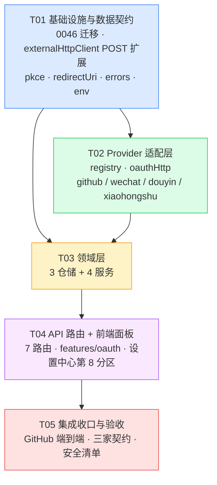

# 系统架构设计：三方授权中心（OAuth Hub）— FeedFuse

> **版本**: v1.0 | **日期**: 2026-08-05 | **作者**: 高见远（Architect）
> **上游依据**: `docs/prd-oauth-hub.md` v0.1（许清楚 / Product Manager）
> **阶段**: 标准 SOP 第二阶段产出 — 工程师须严格按第 6 节任务列表实现
> **配套文件**: `docs/arch-oauth-hub.class-diagram.mermaid` · `docs/arch-oauth-hub.sequence-diagram.mermaid`

---

## 0. 摘要与核心架构决策

**一句话**：在既有 Next.js + pg + secretBox + session 底座上，新增一套**服务端主导、provider-agnostic、零新增运行时依赖**的 OAuth 2.0 授权中心；四家平台适配器全量实现，GitHub 端到端跑通，其余三家以契约测试覆盖并在 UI 呈现「未配置」引导态。

### 0.1 架构决策记录（ADR）总览

| ID | 决策 | 结论 | 对应 AQ |
|----|------|------|---------|
| **ADR-01** | 平台应用配置存储 | **独立表 `oauth_provider_configs`**（一平台一行，provider 为主键）+ `client_secret` 经 secretBox 加密。**不**往 `app_settings` 加列 | AQ-1 |
| **ADR-02** | `state` + `code_verifier` 临时存储 | **独立临时表 `oauth_auth_states`**，TTL 10 分钟。`state` 明文作查询键，`code_verifier` 加密存储。`DELETE ... RETURNING` 原子消费 | AQ-2 |
| **ADR-03** | PKCE 差异化 | provider 抽象层 **`capabilities.supportsPkce` 能力开关**。GitHub `true`（官方已支持，仅 S256），微信 `false`，抖音/小红书**保守默认 `false`** | AQ-4 |
| **ADR-04** | HTTP 出网管线 | **扩展 `externalHttpClient` 支持 POST + 响应体脱敏**，而非裸 `fetch`。OAuth 全部出网请求复用同一条 SSRF 管线 | 新增（阻塞项） |
| **ADR-05** | `redirect_uri` 来源 | 服务端推导（env 优先，回落 `x-forwarded-*`）+ UI 只读展示与一键复制。**发起时锁定并随 state 落库，回调时原样回传** | AQ-6 |
| **ADR-06** | 与现有 GitHub PAT 模块的关系 | **纯加法并存**：新表、新路由、新面板。对既有文件仅做 3 处「新增枚举值」级改动，PAT 链路零改动 | 不破坏性铁律 |
| **ADR-07** | provider endpoint 来源 | 所有 authorize/token/userinfo 端点为**代码内常量**，禁止从 DB 或用户输入读取 | 安全加固 |
| **ADR-08** | 多账号前向兼容 | 唯一键直接建为 `(user_id, provider, provider_account_id)`，MVP 由**服务层**约束单连接，P1 放开即零迁移 | R13 前瞻 |

### 0.2 三个待确认项的最终技术结论

#### ✅ AQ-1 — 全局 `client_id` / `client_secret` 存储

**结论：采用产品侧倾向的「②+③ 组合」——独立配置表 + secretBox 加密。**

| 判据 | 说明 |
|------|------|
| 为何不用 `app_settings` | 它是**单例宽表**，四平台 × 2 字段 = 8 列，且每新增一个平台就要一次 DDL。配置的基数是「平台」而非「应用」，用行建模才是正交的 |
| 为何必须加密 | `client_secret` 是**换取任意用户 token 的主密钥**，敏感级高于单个用户的 access_token。明文落库意味着一次数据库备份泄漏即全平台失守 |
| 为何不引新加密方案 | `secretBox`（AES-256-GCM，密文自带 `v1:` 版本前缀，支持无损密钥轮换识别）已在 `github_token_encrypted` 上验证过，直接复用，零新增攻击面 |

表结构见 §3.1。`client_id` **不加密**（它是公开值，会出现在授权 URL 里），`client_secret` 加密；对外接口只返回 `maskedClientSecret`。

#### ✅ AQ-2 — `code_verifier` 与 `state` 的临时存储

**结论：采用产品侧倾向的「① 服务端临时表」，TTL 10 分钟，`DELETE ... RETURNING` 原子消费 + 惰性清理。**

| 备选 | 否决理由 |
|------|---------|
| ② 服务端 session | 本项目 session 是**无状态签名 cookie**（`session.ts` 的 HMAC payload），没有服务端可写存储位；塞进 cookie 会引入多标签页竞态与体积膨胀 |
| ③ 加密 cookie | 同样存在多标签页并发授权互相覆盖的问题，且 cookie 无法做「一次性消费」语义 |

**关键设计（三点，均为防重放/防错配的要害）**：

1. **一次性消费**：`DELETE FROM oauth_auth_states WHERE state = $1 RETURNING *`——单条 SQL 同时完成「校验存在」与「删除」，天然原子，无需事务与锁。重放同一 `state` 必然返回 0 行。
2. **`code_verifier` 加密存储**：`state` 是 CSRF nonce（非凭据，明文存作查询键），但 `code_verifier` 一旦泄漏 PKCE 保护即失效，属敏感值，用 `secretBox` 加密。
3. **`redirect_uri` 一并落库**：发起时推导出的 `redirect_uri` 存进本行，回调换 token 时**原样回传**，而不是在回调侧重新推导。这一条直接消灭了微信「`redirect_uri` 严格匹配」这个最高频故障点（两侧推导逻辑若有任何差异——端口、尾斜杠、协议——都会导致换 token 失败）。

**清理策略**：不新增定时任务。`insertAuthState` 前顺带执行 `purgeExpiredAuthStates`（`DELETE WHERE expires_at < now()`），配合 `expires_at` 索引，属 O(过期行数) 的廉价惰性清理。表本身是高频进出的小表，量级恒定在「10 分钟内的并发授权数」。

#### ✅ AQ-4 — PKCE 能力开关

**结论：以 `capabilities.supportsPkce` 建模；已查证四家现状如下。**

| 平台 | `supportsPkce` | 依据 |
|------|---------------|------|
| **GitHub** | ✅ `true` | 已查证官方 Changelog《PKCE support for OAuth and GitHub App authentication》(2025-07-14) 与现行文档：`authorize` 接受 `code_challenge` + `code_challenge_method`，**仅接受 `S256`**（`plain` 不支持），换 token 时回传 `code_verifier`。GitHub 不强制 PKCE，但官方推荐 OAuth App 与 GitHub App 都启用 |
| **微信**（开放平台网站应用） | ❌ `false` | 官方文档为传统授权码流程，无 PKCE 参数。另查证到两处**必须在适配器层特殊处理**的差异：① token 交换是 **GET** 请求（`GET https://api.weixin.qq.com/sns/oauth2/access_token?appid=&secret=&code=&grant_type=`）；② 参数名是 `appid`/`secret` 而非 `client_id`/`client_secret`；③ 失败时返回 **HTTP 200 + `{errcode, errmsg}`** |
| **抖音** | ⚠️ `false`（保守默认） | 开放平台文档未提供 PKCE 参数说明。同样存在参数名差异：使用 **`client_key`** 而非 `client_id`，token 端点为 POST，响应体为 `{data: {...}, message}` 嵌套结构且以 `data.error_code` 判定成败 |
| **小红书** | ⚠️ `false`（保守默认） | 开放平台需企业资质，公开文档不可得。按 OAuth 2.0 标准形态实现，端点与参数名集中为常量，待拿到正式文档后校准（见 §8） |

**能力开关不止 PKCE**——上述查证暴露出四家在 **HTTP 方法、参数命名、成功判定** 三个维度上都不一致。因此 `OAuthProviderDefinition` 不能只是「一堆 URL 常量 + 一个 bool」，必须把 `buildTokenRequest` / `parseTokenResponse` 作为**可覆写的适配器方法**暴露（见 §3.2）。这是本设计中 provider 抽象层的核心价值所在。

> **对工程师的指令**：抖音/小红书先按 `supportsPkce: false` 实现并跑通契约测试；未来确认支持后，**只改这一个布尔常量**，`oauthAuthorizeService` 与 `oauthCallbackService` 的流程代码不得改动。若改动了流程代码，说明抽象层设计失败，需回退重做。

---

## 1. 实现方案与框架选型

### 1.1 技术难点分析

| # | 难点 | 应对 |
|---|------|------|
| D1 | **四家平台 OAuth 实现严重不齐**：HTTP 方法、参数命名、成功判定、PKCE 支持全都不同 | provider 适配器模式：核心流程只依赖 `OAuthProviderDefinition` 接口，差异全部下沉到 4 个适配器文件（§3.2） |
| D2 | **现有出网管线只支持 GET**，而 OAuth token 交换主要是 POST | 向后兼容扩展 `externalHttpClient`（ADR-04），而非绕过它裸 `fetch`——绕过就等于丢掉 SSRF 逐跳校验与日志脱敏 |
| D3 | **token 交换的响应体含 access_token 明文**，而现有日志管线会记录响应体 | 新增 `logging.redactResponseBody` 开关，OAuth 出网一律置 `true`（详见 §1.4 安全审查） |
| D4 | **`redirect_uri` 严格匹配**（微信），自部署域名各异 | 发起时锁定 + 随 state 落库 + 回调原样回传（ADR-05）；UI 只读展示供用户复制到平台后台 |
| D5 | **回调是跨站顶层 GET 导航**，需确认会话不丢 | 已核验 `session.ts` 的 cookie 为 `SameSite=Lax`——Lax 恰好放行跨站顶层 GET 导航，会话可用。回调侧额外校验 `state.userId === session.userId` 作双重防护 |
| D6 | **不得破坏现有 GitHub PAT 链路** | 纯加法（ADR-06）：新表 / 新路由 / 新面板，对既有文件只做 3 处新增枚举值级改动，§2.3 逐条列明 |

### 1.2 框架与库选型

| 能力 | 选型 | 理由 |
|------|------|------|
| Web 框架 | **Next.js 16 App Router**（现有） | 沿用，不引入新框架 |
| 数据库 | **PostgreSQL + `pg`**（现有） | 沿用，迁移走 `scripts/db/migrate.mjs` |
| 加密 | **`secretBox`**（现有，AES-256-GCM） | 已在 GitHub PAT 上验证；密文自带版本前缀，支持密钥轮换 |
| 密钥管理 | **`secretKeyProvider.resolveSecretKey`**（现有） | env 优先 + DB 兜底，零配置可用 |
| 会话 | **`requireApiSession`**（现有） | 连接按 `userId` 天然隔离 |
| 出网 | **`fetchExternalJson`**（现有 + 最小扩展） | 复用 SSRF 逐跳校验 + 主机白名单 + 日志脱敏 |
| PKCE / state | **`node:crypto`**（Node 内置） | `randomBytes` + `createHash('sha256')` + `base64url` 即可，**零依赖** |
| 前端 | **React 19 + Radix UI + Tailwind 4**（现有） | 版式对齐 `GithubSettingsPanel` |

### 1.3 为何自建轻量 OAuth 流程，而不引第三方库

对标 GitHub 模块「不引 `@octokit/rest`」的既有决策，本模块同样自建：

| 候选库 | 否决理由 |
|--------|---------|
| `next-auth` / `Auth.js` | **场景错配**。它解决的是「用三方账号登录本站」，会接管整个会话体系；而本模块是「已登录用户绑定三方账号」，两者语义正交。引入它等于要么架空现有 `session.ts`，要么维护两套会话——直接违反不破坏性铁律 |
| `openid-client` | 面向标准 OIDC Provider（依赖 discovery 文档 + JWKS）。微信/抖音/小红书**均非合规 OIDC**，库的核心能力全用不上，只剩一层薄封装，却引入了完整依赖树 |
| `simple-oauth2` | 假定标准 `POST + form + client_id/client_secret`。微信是 GET、抖音是 `client_key`、两家都在 HTTP 200 里返错误码——**四家里有三家要打补丁绕过它**，抽象泄漏比自建更严重 |
| `oauth2-pkce` / `react-oauth2-code-pkce` | 纯前端库（PRD §0 已调研）。会把 `client_secret` 和 token 交换推到浏览器，**直接违反安全红线** |

**自建成本核算**：PKCE 生成约 20 行、authorize URL 拼装约 15 行/平台、token 请求约 40 行、错误归一约 60 行。总计约 300 行可控代码，换取零供应链风险 + 对四家平台怪癖的完全掌控。**结论：自建。**

### 1.4 安全审查发现（工程师必读）

> 以下三条是设计阶段对既有底座做安全走查时发现的**真实风险**，均已纳入 T01 处置。

| # | 风险 | 处置 |
|---|------|------|
| **S1** | `writeExternalRequestLog` 在**非 2xx** 分支会把响应体写入 `system_logs.details`。若平台在 4xx 响应中回显凭据信息，token/secret 将落进日志表 | 为 `fetchExternalJson` 新增 `logging.redactResponseBody?: boolean`；OAuth 全部出网请求置 `true`，`details` 一律写 `[redacted]` |
| **S2** | `fetchTextWithValidatedRedirects` 会把**同一组 headers 带到重定向后的地址**。若 POST 携带 `client_secret` 的请求发生跨站重定向，secret 将泄漏给第三方 | OAuth 的 POST 请求强制 `maxRedirects: 0`，收到 3xx 直接抛 `OAuthError(network)`。token 端点本就不应重定向 |
| **S3** | 若把 provider 端点做成可配置项，恶意管理员可把 token 端点指向内网地址，用 `client_secret` 做 SSRF 探测 | ADR-07：端点全部为代码常量；`allowedHosts` 白名单由 `oauthProviderRegistry.collectAllowedHosts()` 从常量派生，用户输入无法影响 |

---

## 2. 文件列表

### 2.1 新增文件

| 路径 | 职责 |
|------|------|
| `src/server/infra/db/migrations/0046_oauth_hub.sql` | 三张表 + 索引 + 约束（全部 `if not exists`） |
| **Provider 适配层** `src/server/integrations/oauth/` | |
| `oauthProviderTypes.ts` | `OAuthProviderDefinition` / `OAuthProviderCapabilities` / `OAuthTokenRequest` / `OAuthTokenBundle` / `OAuthProfile` 接口定义 |
| `oauthProviderRegistry.ts` | 四家注册表；`getProvider` / `listProviders` / `collectAllowedHosts` |
| `oauthErrors.ts` | `OAuthError` + `OAuthErrorKind` + 中文文案表 + `toAppError()` |
| `pkce.ts` | `createState` / `createCodeVerifier` / `deriveCodeChallenge`（`node:crypto`） |
| `oauthHttp.ts` | `requestToken`：封装 token 交换与刷新，复用 `fetchExternalJson` |
| `providers/github.ts` | GitHub 适配器（`supportsPkce: true`，scope `read:user`） |
| `providers/wechat.ts` | 微信适配器（GET token、`appid`/`secret`、`errcode` 判定、`#wechat_redirect`） |
| `providers/douyin.ts` | 抖音适配器（`client_key`、POST JSON、`data.error_code` 判定） |
| `providers/xiaohongshu.ts` | 小红书适配器（标准形态占位，端点集中常量） |
| **领域层** `src/server/domains/oauth/` | |
| `types.ts` | 领域内类型与 DTO（`OAuthConnectionView` / `OAuthProviderConfigStatus`） |
| `redirectUri.ts` | `resolvePublicBaseUrl` / `buildRedirectUri` / `sanitizeReturnTo` |
| `repositories/oauthProviderConfigsRepo.ts` | 全局配置读写 |
| `repositories/oauthConnectionsRepo.ts` | per-user 连接读写（全部带 `user_id` 谓词） |
| `repositories/oauthAuthStatesRepo.ts` | state 插入 / 原子消费 / 过期清理 |
| `services/oauthConfigService.ts` | 配置状态、保存/清除、`resolveClientCredentials`、`maskSecret` |
| `services/oauthAuthorizeService.ts` | `startAuthorization`（生成 state/PKCE、落库、拼 URL） |
| `services/oauthCallbackService.ts` | `handleCallback`（校验 state、换 token、加密落库） |
| `services/oauthConnectionService.ts` | 列表 / 撤销 / 刷新 / `ensureFreshAccessToken` |
| **API 路由** `src/app/api/oauth/` | |
| `providers/route.ts` | `GET` 四平台配置状态列表 |
| `providers/[provider]/route.ts` | `PUT` 保存配置 · `DELETE` 清除配置 |
| `authorize/route.ts` | `GET ?provider=` → 返回 `authorizeUrl` |
| `callback/[provider]/route.ts` | `GET` 平台回跳 → 302 回设置中心 |
| `connections/route.ts` | `GET` 当前用户连接列表 |
| `connections/[id]/route.ts` | `DELETE` 撤销连接 |
| `connections/[id]/refresh/route.ts` | `POST` 手动刷新 token |
| **前端** `src/features/oauth/` | |
| `utils/oauthProviderMeta.ts` | 平台展示元信息（名称/图标/说明文案） |
| `hooks/useOAuthHub.ts` | 配置与连接的加载与变更（对标 `useGithubRepos`） |
| `components/OAuthProviderConfigForm.tsx` | Client ID / Secret 表单（掩码输入 + 打码回显） |
| `components/OAuthRedirectUriField.tsx` | `redirect_uri` 只读展示 + 一键复制 |
| `components/OAuthConnectionBadge.tsx` | 状态徽章（已连接/未连接/已过期/未配置） |
| `components/OAuthProviderCard.tsx` | 平台卡片（徽章 + 授权/重新授权 + 撤销 + 确认弹窗） |
| `src/features/settings/panels/OAuthSettingsPanel.tsx` | 「三方授权」分区面板（说明条 + 可折叠配置区 + 卡片列表） |

### 2.2 新增测试文件

| 路径 | 覆盖 |
|------|------|
| `src/test/server/db/migrations/oauthHubMigration.test.ts` | 0046 幂等性、约束、索引 |
| `src/test/server/integrations/oauth/pkce.test.ts` | verifier 长度/字符集、S256 challenge 正确性 |
| `src/test/server/integrations/oauth/providers.contract.test.ts` | **四家契约测试**：authorize URL 拼装、token 请求形态、响应解析、错误码判定（mock 平台响应，AQ-3 验收依据） |
| `src/test/server/integrations/oauth/oauthErrors.test.ts` | 错误归一与中文文案 |
| `src/test/server/domains/oauth/oauthAuthorizeService.test.ts` | 未配置拒绝、PKCE 分支、state 落库 |
| `src/test/server/domains/oauth/oauthCallbackService.test.ts` | state 重放/过期/跨用户拒绝、token 加密落库 |
| `src/test/server/domains/oauth/oauthConnectionService.test.ts` | 用户隔离、撤销、刷新成功与失败置 expired |
| `src/test/server/domains/oauth/redirectUri.test.ts` | env 优先、`x-forwarded-*` 回落、`returnTo` 开放重定向防护 |
| `src/test/server/http/externalHttpClientPost.test.ts` | POST 扩展、`maxRedirects=0`、`redactResponseBody` |

### 2.3 修改的既有文件（**全部为加法，逐条列明，不得有删改**）

| 文件 | 改动 | 破坏性 |
|------|------|--------|
| `src/server/infra/http/externalHttpClient.ts` | 新增可选 `method` / `form` / `redactResponseBody`；`fetchTextHop` 的 `method` 由硬编码改为参数（**默认值 `'GET'`**） | 无（默认行为逐字节不变） |
| `src/server/infra/env.ts` | 新增可选 `FEEDFUSE_PUBLIC_BASE_URL` | 无（可选项） |
| `src/features/settings/components/SettingsCenterDrawer.tsx` | ① `SettingsSectionKey` 联合类型追加 `'oauth'`；② `sectionItems` 追加一项（置于 `github` 与 `logging` 之间）；③ `sectionErrors` 对象补 `oauth: 0`（TS `Record` 完备性要求）；④ 追加 `TabsContent` | 无（纯追加） |
| `src/lib/userOperationCatalog.ts` | `UserOperationActionKey` 追加 6 个键 + 对应文案（见 §7.3） | 无（纯追加） |
| `src/lib/api/apiClient.ts` | 追加 OAuth 相关请求函数 | 无（纯追加） |
| `src/types/index.ts` | 追加 OAuth DTO 类型 | 无（纯追加） |
| `src/features/reader/components/ReaderLayout.tsx` | 追加回调 query（`?settings=oauth&oauth=...`）解析 → 打开设置抽屉 + toast + `replaceState` 清理 | 无（纯追加） |
| `src/features/settings/panels/GithubSettingsPanel.tsx` | **仅追加一句互指说明文案**（AQ-5，待用户确认文案后执行） | 无（纯文案） |

> **红线**：`githubTokenService.ts`、`src/app/api/settings/github/token/route.ts`、`user_settings.github_token_encrypted` 及其调用链**一行都不许动**。

---

## 3. 数据结构与接口

### 3.1 数据库 DDL（`0046_oauth_hub.sql`）

```sql
-- ============================================================
-- 0046_oauth_hub.sql —— 三方授权中心（T01 基础设施与数据契约）
--
-- 设计原则（见 docs/arch-oauth-hub.md ADR-01 / ADR-02 / ADR-08）：
--   1. 平台应用配置按「行」建模而非往 app_settings 加列，新增平台零 DDL。
--   2. 一切凭据类字段落库前必须经 secretBox 加密（列名统一 *_encrypted 后缀）。
--   3. 授权临时态独立成表，一次性消费 + TTL，不污染 session。
--
-- 迁移安全性：
--   全部为 create table if not exists / create index if not exists，
--   不触碰任何存量表与约束，对现有 GitHub PAT 链路零影响，
--   可安全回滚（drop 三张新表即可）。
-- ============================================================

-- ------------------------------------------------------------
-- (1) 平台应用配置（全局单例，与用户无关）
--     provider 作主键：新增平台只插一行，无需 DDL。
--     client_id 明文（公开值，会出现在授权 URL 中）；
--     client_secret 必须加密，明文永不落库。
-- ------------------------------------------------------------
create table if not exists oauth_provider_configs (
  provider                  text primary key,
  client_id                 text        not null default '',
  client_secret_encrypted   text        not null default '',
  enabled                   boolean     not null default true,
  -- 平台差异化配置预留（如自定义 scope、企业号 agentId），MVP 恒为 {}。
  extra_config              jsonb       not null default '{}'::jsonb,
  created_at                timestamptz not null default now(),
  updated_at                timestamptz not null default now(),
  constraint oauth_provider_configs_provider_check
    check (provider in ('github', 'wechat', 'douyin', 'xiaohongshu'))
);

-- ------------------------------------------------------------
-- (2) 用户级授权连接
--     唯一键提前落地为 (user_id, provider, provider_account_id)：
--     MVP 由服务层约束「每平台单连接」，R13 多账号放开服务层即可零迁移（ADR-08）。
--     status 四态提前进 CHECK，同样为零迁移扩展。
-- ------------------------------------------------------------
create table if not exists oauth_connections (
  id                        bigserial   primary key,
  user_id                   bigint      not null references users(id) on delete cascade,
  provider                  text        not null,
  -- 平台侧账号唯一标识：GitHub id / 微信 unionid 优先 openid 兜底 / 抖音 open_id
  provider_account_id       text        not null,

  -- 凭据（一律 secretBox 密文）
  access_token_encrypted    text        not null,
  refresh_token_encrypted   text        null,
  token_type                text        null,
  scope                     text        null,
  access_token_expires_at   timestamptz null,
  refresh_token_expires_at  timestamptz null,

  status                    text        not null default 'active',
  -- 展示用快照：仅昵称 / 头像 URL，严禁写入任何凭据（R21 预留）
  profile_snapshot          jsonb       not null default '{}'::jsonb,

  authorized_at             timestamptz not null default now(),
  last_refreshed_at         timestamptz null,
  created_at                timestamptz not null default now(),
  updated_at                timestamptz not null default now(),

  constraint oauth_connections_provider_check
    check (provider in ('github', 'wechat', 'douyin', 'xiaohongshu')),
  constraint oauth_connections_status_check
    check (status in ('active', 'expired', 'revoked'))
);

create unique index if not exists idx_oauth_connections_user_provider_account
  on oauth_connections (user_id, provider, provider_account_id);

create index if not exists idx_oauth_connections_user_id
  on oauth_connections (user_id);

-- ------------------------------------------------------------
-- (3) 授权临时态（state + PKCE verifier），TTL 10 分钟
--     state 明文作主键：它是 CSRF nonce 而非凭据，且需要作等值查询键。
--     code_verifier 属敏感值（泄漏即 PKCE 失效），必须加密。
--     redirect_uri 在发起时锁定并存此，回调换 token 时原样回传，
--     杜绝两侧推导不一致（微信严格匹配最高频故障点，ADR-05）。
-- ------------------------------------------------------------
create table if not exists oauth_auth_states (
  state                     text        primary key,
  provider                  text        not null,
  user_id                   bigint      not null references users(id) on delete cascade,
  code_verifier_encrypted   text        null,
  redirect_uri              text        not null,
  -- 授权完成后的站内回跳路径，只允许相对路径（防开放重定向）
  return_to                 text        null,
  expires_at                timestamptz not null,
  created_at                timestamptz not null default now(),

  constraint oauth_auth_states_provider_check
    check (provider in ('github', 'wechat', 'douyin', 'xiaohongshu'))
);

-- 惰性清理扫描用（DELETE WHERE expires_at < now()）
create index if not exists idx_oauth_auth_states_expires_at
  on oauth_auth_states (expires_at);
```

### 3.2 核心 TypeScript 接口

> 完整类图见 `docs/arch-oauth-hub.class-diagram.mermaid`。

```ts
// src/server/integrations/oauth/oauthProviderTypes.ts

export type OAuthProviderId = 'github' | 'wechat' | 'douyin' | 'xiaohongshu';

/** AQ-4：平台能力开关。新增平台差异时优先在此扩字段，而非在流程里写 if。 */
export interface OAuthProviderCapabilities {
  /** 是否支持 PKCE。仅 GitHub 为 true；抖音/小红书保守默认 false。 */
  supportsPkce: boolean;
  /** 是否支持 refresh_token 续期。 */
  supportsRefresh: boolean;
  /** 是否支持平台侧远程撤销（R23，P2）。MVP 四家均为 false。 */
  supportsRemoteRevoke: boolean;
  /** redirect_uri 是否要求逐字节严格匹配（微信为 true，影响 UI 提示强度）。 */
  requiresExactRedirectUri: boolean;
}

/** token 请求描述。四家在方法与编码上不一致，故抽象为数据而非硬编码。 */
export interface OAuthTokenRequest {
  url: string;
  method: 'GET' | 'POST';
  headers: Record<string, string>;
  /** 参数集合；GET 时序列化进 query，POST 时按 bodyKind 编码。 */
  form: Record<string, string>;
  bodyKind: 'query' | 'form-urlencoded' | 'json';
}

export interface OAuthTokenBundle {
  accessToken: string;
  refreshToken: string | null;
  tokenType: string | null;
  scope: string | null;
  expiresIn: number | null;
  refreshExpiresIn: number | null;
  /** 平台侧账号唯一标识，部分平台随 token 一起返回（微信 unionid、抖音 open_id）。 */
  providerAccountId: string | null;
}

export interface OAuthProfile {
  providerAccountId: string;
  displayName: string | null;
  avatarUrl: string | null;
}

export interface OAuthProviderDefinition {
  id: OAuthProviderId;
  displayName: string;
  capabilities: OAuthProviderCapabilities;

  /** 端点一律代码常量，禁止从 DB / 用户输入读取（ADR-07）。 */
  authorizeEndpoint: string;
  tokenEndpoint: string;
  refreshEndpoint: string | null;
  userInfoEndpoint: string | null;
  /** 需要服务端出网访问的主机白名单（authorize 是浏览器跳转，不计入）。 */
  allowedHosts: string[];
  defaultScopes: string[];

  buildAuthorizeUrl(input: {
    clientId: string;
    redirectUri: string;
    state: string;
    scopes: string[];
    codeChallenge: string | null;
  }): string;

  buildTokenRequest(input: {
    clientId: string;
    clientSecret: string;
    code: string;
    redirectUri: string;
    codeVerifier: string | null;
  }): OAuthTokenRequest;

  buildRefreshRequest(input: {
    clientId: string;
    clientSecret: string;
    refreshToken: string;
  }): OAuthTokenRequest | null;

  /** 必须在此判定平台业务错误（微信 errcode / 抖音 data.error_code），HTTP 200 不等于成功。 */
  parseTokenResponse(raw: unknown): OAuthTokenBundle;

  fetchProfile(input: {
    accessToken: string;
    providerAccountId: string | null;
  }): Promise<OAuthProfile | null>;
}
```

```ts
// src/server/integrations/oauth/oauthErrors.ts

export type OAuthErrorKind =
  | 'not_configured'         // 平台未配置 client_id / secret
  | 'user_denied'            // 用户在平台侧点了取消
  | 'invalid_state'          // state 不存在 / 已消费 / 归属用户不符
  | 'state_expired'          // state 超过 10 分钟 TTL
  | 'redirect_uri_mismatch'  // 平台判定 redirect_uri 不匹配
  | 'token_exchange_failed'  // code 换 token 失败
  | 'refresh_failed'         // refresh_token 续期失败
  | 'provider_error'         // 平台返回业务错误码
  | 'network';               // 超时 / DNS / SSRF 拦截
```

### 3.3 API 契约

> 统一信封沿用 `apiResponse`：成功 `{ ok: true, data }`，失败 `{ ok: false, error: { code, message, fields? } }`。

| 方法 | 路径 | 入参 | 出参 | 说明 |
|------|------|------|------|------|
| `GET` | `/api/oauth/providers` | — | `OAuthProviderConfigStatus[]` | 四平台配置状态。**secret 只返回打码值** |
| `PUT` | `/api/oauth/providers/{provider}` | `{ clientId, clientSecret? }` | `OAuthProviderConfigStatus` | `clientSecret` 省略表示保留原值 |
| `DELETE` | `/api/oauth/providers/{provider}` | — | `OAuthProviderConfigStatus` | 清除该平台配置 |
| `GET` | `/api/oauth/authorize?provider=&returnTo=` | query | `{ authorizeUrl }` | 前端拿到后自行 `location.assign` |
| `GET` | `/api/oauth/callback/{provider}` | `code`, `state` / `error` | **302 重定向** | 唯一不返回 JSON 的路由 |
| `GET` | `/api/oauth/connections` | — | `OAuthConnectionView[]` | **绝不含任何 token 字段** |
| `DELETE` | `/api/oauth/connections/{id}` | — | `{ id }` | 撤销 |
| `POST` | `/api/oauth/connections/{id}/refresh` | — | `OAuthConnectionView` | 手动刷新 |

```ts
export interface OAuthProviderConfigStatus {
  provider: OAuthProviderId;
  displayName: string;
  configured: boolean;
  clientId: string;              // 公开值，明文返回
  maskedClientSecret: string | null; // 形如 "abcd****wxyz"，永不返回明文
  enabled: boolean;
  redirectUri: string;           // 服务端推导，供用户复制到平台后台（ADR-05）
  supportsPkce: boolean;
  requiresExactRedirectUri: boolean;
}

export interface OAuthConnectionView {
  id: string;
  provider: OAuthProviderId;
  status: 'active' | 'expired' | 'revoked';
  displayName: string | null;
  avatarUrl: string | null;
  authorizedAt: string;                 // ISO 8601 UTC
  accessTokenExpiresAt: string | null;
  canRefresh: boolean;
}
```

**回调路由的重定向契约**（唯一非 JSON 路由）：

```
成功: 302 → {returnTo}?settings=oauth&oauth=success&provider={provider}
取消: 302 → {returnTo}?settings=oauth&oauth=denied&provider={provider}
失败: 302 → {returnTo}?settings=oauth&oauth=failed&provider={provider}&reason={kind}
```

前端在 `ReaderLayout` 挂载时读取上述 query → 调 `openSettings('oauth')` → 按 `oauth` 与 `reason` 触发对应 toast → `history.replaceState` 清除 query（避免刷新重复提示）。

---

## 4. 程序调用流程

> 完整时序图见 `docs/arch-oauth-hub.sequence-diagram.mermaid`，共四段：① 授权发起 ② 平台回调 ③ 连接列表与撤销 ④ Token 刷新。

### 4.1 授权发起（R02）关键点

1. `requireApiSession` 先行——未登录不产生任何 `state` 记录。
2. `resolveClientCredentials` 若 `clientId` 为空或 `enabled=false` → `OAuthError('not_configured')`，UI 呈现「未配置」引导态（**这正是微信/抖音/小红书在本机的默认表现，符合 AQ-3 验收口径**）。
3. PKCE 分支由 `capabilities.supportsPkce` 决定，是流程中**唯一**的平台差异判断点。
4. `redirect_uri` 推导后**立即随 state 落库**——这是 ADR-05 的落点。
5. 授权 URL 由 provider 适配器拼装（微信的 `#wechat_redirect` fragment 必须在最末，故其 `buildAuthorizeUrl` 需覆写而非走通用拼装）。

### 4.2 平台回调（R03 + R04）关键点

1. **平台 `error` 参数优先处理**——用户点取消时不应走后续任何逻辑。
2. **`consumeAuthState` 原子消费**：`DELETE ... RETURNING` 一步到位，重放必然落空（R03「state 为一次性，重放无效」的实现依据）。
3. **三重校验**：存在性 → TTL → `state.userId === session.userId`。任一不过即拒绝，且**不写入任何数据**。
4. **`redirect_uri` 取自 state 表**，不重新推导。
5. `parseTokenResponse` 中判定平台业务错误——**HTTP 200 不等于成功**（微信 `errcode`、抖音 `data.error_code`）。
6. profile 拉取失败**不阻断主流程**，降级为空快照（R21 是 P2，不能让它拖垮 P0 闭环）。
7. token 加密后 upsert；同 `(userId, provider)` 先删后插，天然覆盖「重新授权」R14。

### 4.3 撤销与刷新关键点

- 撤销的 SQL 谓词**必须同时带 `user_id` 与 `id`**，越权在数据层即失败，不依赖上层判断。
- 刷新失败时**保留连接行并置 `status='expired'`**，而非删除——用户需要看到「已过期 + 重新授权」而不是连接凭空消失。

---

## 5. 依赖包

### 5.1 新增运行时依赖

**无。** 本模块不引入任何第三方运行时依赖。

| 需求 | 用什么解决 |
|------|-----------|
| 随机 state / code_verifier | `node:crypto` `randomBytes` |
| S256 code_challenge | `node:crypto` `createHash('sha256')` + `base64url` |
| HTTP 出网 | 既有 `externalHttpClient`（底层 `got`，已在依赖中） |
| 加解密 | 既有 `secretBox`（`node:crypto` AES-256-GCM） |
| URL 拼装 | 平台内置 `URL` / `URLSearchParams` |

> 理由详见 §1.3。若后续确有引入必要，须先补充 ADR 并说明为何自建方案不可行。

### 5.2 新增环境变量

| 变量 | 必填 | 默认 | 说明 |
|------|------|------|------|
| `FEEDFUSE_PUBLIC_BASE_URL` | 否 | 空 | 站点对外访问基址（如 `https://reader.example.com`）。用于推导 `redirect_uri`。**反向代理场景强烈建议显式配置**；留空时回落 `x-forwarded-proto` + `x-forwarded-host` / `host` |

---

## 6. 任务列表（有序，含依赖）

### T01 — 基础设施与数据契约

| 项 | 内容 |
|----|------|
| **优先级** | P0 |
| **依赖** | 无 |
| **文件** | `src/server/infra/db/migrations/0046_oauth_hub.sql`（新增）<br>`src/server/infra/http/externalHttpClient.ts`（**扩展**：`method` / `form` / `redactResponseBody`）<br>`src/server/infra/env.ts`（**扩展**：`FEEDFUSE_PUBLIC_BASE_URL`）<br>`src/server/integrations/oauth/oauthProviderTypes.ts`（新增）<br>`src/server/integrations/oauth/oauthErrors.ts`（新增）<br>`src/server/integrations/oauth/pkce.ts`（新增）<br>`src/server/domains/oauth/redirectUri.ts`（新增）<br>`src/server/domains/oauth/types.ts`（新增）<br>`src/test/server/db/migrations/oauthHubMigration.test.ts`（新增）<br>`src/test/server/integrations/oauth/pkce.test.ts`（新增）<br>`src/test/server/http/externalHttpClientPost.test.ts`（新增）<br>`src/test/server/domains/oauth/redirectUri.test.ts`（新增） |
| **验收** | ① 迁移可重复执行且幂等；② `fetchExternalJson` 默认行为**逐字节不变**（现有 GitHub 测试全绿）；③ POST 分支强制 `maxRedirects=0`；④ `redactResponseBody=true` 时 `system_logs.details` 为 `[redacted]`；⑤ `deriveCodeChallenge` 输出符合 RFC 7636 S256 测试向量；⑥ `sanitizeReturnTo` 拒绝绝对 URL 与协议相对 URL |

> ⚠️ **T01 是唯一触碰既有基础设施的任务**，改动必须严格向后兼容。先跑一遍现有全量测试建立基线，改完再跑一遍对比。

### T02 — Provider 适配层（四家）

| 项 | 内容 |
|----|------|
| **优先级** | P0 |
| **依赖** | T01 |
| **文件** | `src/server/integrations/oauth/oauthProviderRegistry.ts`（新增）<br>`src/server/integrations/oauth/oauthHttp.ts`（新增）<br>`src/server/integrations/oauth/providers/github.ts`（新增）<br>`src/server/integrations/oauth/providers/wechat.ts`（新增）<br>`src/server/integrations/oauth/providers/douyin.ts`（新增）<br>`src/server/integrations/oauth/providers/xiaohongshu.ts`（新增）<br>`src/test/server/integrations/oauth/providers.contract.test.ts`（新增）<br>`src/test/server/integrations/oauth/oauthErrors.test.ts`（新增） |
| **验收** | ① 四家 `buildAuthorizeUrl` 产出的 URL 参数与各平台文档逐项对齐（微信 `appid` + 末尾 `#wechat_redirect`；抖音 `client_key`；GitHub 含 `code_challenge_method=S256`）；② 微信 `buildTokenRequest` 为 **GET**；③ 微信 `errcode!==0`、抖音 `data.error_code!==0` 时 `parseTokenResponse` 抛 `OAuthError('provider_error')`（**HTTP 200 也要抛**）；④ `collectAllowedHosts()` 覆盖四家全部出网主机；⑤ 契约测试以 mock 响应覆盖四家成功与失败分支——**这是微信/抖音/小红书的验收依据（AQ-3）** |

### T03 — 领域层（仓储 + 服务）

| 项 | 内容 |
|----|------|
| **优先级** | P0 |
| **依赖** | T01, T02 |
| **文件** | `src/server/domains/oauth/repositories/oauthProviderConfigsRepo.ts`（新增）<br>`src/server/domains/oauth/repositories/oauthConnectionsRepo.ts`（新增）<br>`src/server/domains/oauth/repositories/oauthAuthStatesRepo.ts`（新增）<br>`src/server/domains/oauth/services/oauthConfigService.ts`（新增）<br>`src/server/domains/oauth/services/oauthAuthorizeService.ts`（新增）<br>`src/server/domains/oauth/services/oauthCallbackService.ts`（新增）<br>`src/server/domains/oauth/services/oauthConnectionService.ts`（新增）<br>`src/test/server/domains/oauth/oauthAuthorizeService.test.ts`（新增）<br>`src/test/server/domains/oauth/oauthCallbackService.test.ts`（新增）<br>`src/test/server/domains/oauth/oauthConnectionService.test.ts`（新增） |
| **验收** | ① `consumeAuthState` 为单条 `DELETE ... RETURNING`，重放返回 null；② state 过期、跨用户（`state.userId !== sessionUserId`）均拒绝且不写库；③ 所有 token 落库前经 `seal()`，DB 中断言无明文；④ 连接类仓储函数 SQL **全部带 `user_id` 谓词**（用户 A 读不到 B）；⑤ `getProviderConfigStatuses` 返回值断言不含 secret 明文；⑥ 刷新失败置 `status='expired'` 而非删除 |

### T04 — API 路由 + 前端面板

| 项 | 内容 |
|----|------|
| **优先级** | P0 |
| **依赖** | T03 |
| **文件** | `src/app/api/oauth/providers/route.ts`、`providers/[provider]/route.ts`、`authorize/route.ts`、`callback/[provider]/route.ts`、`connections/route.ts`、`connections/[id]/route.ts`、`connections/[id]/refresh/route.ts`（均新增）<br>`src/features/oauth/utils/oauthProviderMeta.ts`、`hooks/useOAuthHub.ts`、`components/OAuthProviderConfigForm.tsx`、`components/OAuthRedirectUriField.tsx`、`components/OAuthConnectionBadge.tsx`、`components/OAuthProviderCard.tsx`（均新增）<br>`src/features/settings/panels/OAuthSettingsPanel.tsx`（新增）<br>`src/features/settings/components/SettingsCenterDrawer.tsx`（**追加第 8 分区**）<br>`src/lib/userOperationCatalog.ts`、`src/lib/api/apiClient.ts`、`src/types/index.ts`（**追加**）<br>`src/features/reader/components/ReaderLayout.tsx`（**追加**回调 query 处理） |
| **验收** | ① 七个路由均以 `requireApiSession` 起手，未登录 401；② 回调路由返回 302 而非 JSON；③ 「三方授权」置于「GitHub」与「日志」之间，与 GitHub 分区平级；④ 版式对齐 `GithubSettingsPanel`（`Button size="compact"`、`AlertDialog` 撤销确认、只用语义 token）；⑤ **接口响应体全量断言不含 token / secret 明文**；⑥ 未配置平台按钮禁用 + tooltip；⑦ `redirect_uri` 只读 + 一键复制；⑧ **现有 GitHub 分区功能回归无损** |

### T05 — 集成收口、验收与文档

| 项 | 内容 |
|----|------|
| **优先级** | P0 |
| **依赖** | T04 |
| **文件** | 全量回归；`CODE_WIKI.md`、`CHANGELOG.md`、`docs/user-guide.md`（追加「三方授权」章节与 `redirect_uri` 配置指引） |
| **验收** | ① **GitHub 端到端跑通**：真实 OAuth App → 授权 → 回调 → 已连接 → 撤销 → 未连接（AQ-3 硬性要求）；② 微信/抖音/小红书契约测试全绿 + UI 呈现「未配置」引导态；③ `pnpm lint` / `type-check` / `test` 全绿；④ **安全清单逐条核验**（§7.5）：DB 无明文凭据、接口响应无凭据、`system_logs` 无凭据；⑤ 现有 GitHub PAT 链路回归无损 |

### 6.1 任务依赖图



### 6.2 不在 MVP 范围（P1 / P2 预留）

| ID | 内容 | 预留方式 |
|----|------|---------|
| R11 | Token **自动**刷新调度 | MVP 已实现刷新服务与手动刷新路由 + `ensureFreshAccessToken`；仅后台调度不做 |
| R13 | 同一平台多账号 | 唯一键已含 `provider_account_id`（ADR-08），放开服务层限制即可，零迁移 |
| R21 | Profile 元信息展示 | `profile_snapshot` 列与 `fetchProfile` 已就位，前端展示后置 |
| R22 | 撤销级联清理 | 本期无衍生数据，暂不适用 |
| R23 | 平台侧远程撤销 | `capabilities.supportsRemoteRevoke` 开关已预埋，四家 MVP 均 `false` |
| R24 | 授权审计日志 | 复用现有 `system_logs`，独立时间线 UI 后置 |

---

## 7. 共享知识（跨文件约定）

### 7.1 命名与分层

- 加密列一律 `*_encrypted` 后缀，其值必为 `secretBox` 密文（`v1:iv:tag:ct`）。
- `src/server/integrations/oauth/` 只放**平台差异**，不碰数据库；`src/server/domains/oauth/` 只放**业务编排**，不硬编码平台细节。任何一侧越界都是设计事故。
- 仓储函数命名对齐既有风格：`list*` / `get*` / `upsert*` / `delete*`。
- 时间字段一律 `timestamptz`，DTO 中一律 ISO 8601 UTC 字符串。

### 7.2 错误归一

- 服务端内部抛 `OAuthError`，在**路由边界**统一 `toAppError()` 转成 `AppError` 后交给 `fail()`。
- 面向用户的 `message` **一律中文**；技术细节只进 `detail` 并写日志，不出网。
- 沿用既有 `ValidationError` 做字段级表单校验（如 `clientId` 为空）。

### 7.3 前端反馈 actionKey（需在 `userOperationCatalog.ts` 追加）

| actionKey | 成功文案 |
|-----------|---------|
| `oauth.config.save` | 已保存平台配置 |
| `oauth.config.clear` | 已清除平台配置 |
| `oauth.authorize.start` | 正在跳转授权… |
| `oauth.authorize.result` | 已连接（失败分支按 `reason` 分文案，R12） |
| `oauth.connection.revoke` | 已撤销授权 |
| `oauth.connection.refresh` | 已刷新授权凭证 |

### 7.4 SSRF 白名单扩展方式

- 每个 provider 在自己的文件里声明 `allowedHosts`；`oauthProviderRegistry.collectAllowedHosts()` 汇总。
- `oauthHttp.requestToken` 调 `fetchExternalJson` 时传 `allowedHosts: provider.allowedHosts`——白名单**逐跳生效**。
- authorize 端点是浏览器跳转、不经服务端 fetch，**不计入**白名单，但其 host 仍必须是代码常量（ADR-07）。
- 参考主机（以各平台最新文档为准，实现时在适配器内注明出处）：GitHub `github.com` / `api.github.com`；微信 `api.weixin.qq.com`；抖音 `open.douyin.com`；小红书待确认。

### 7.5 安全红线（T05 逐条核验）

| # | 红线 |
|---|------|
| 1 | `client_secret` / `access_token` / `refresh_token` / `code_verifier` **永不明文落库** |
| 2 | 上述值**永不出现在任何 API 响应**中，对外只给 `masked*` 或布尔状态 |
| 3 | 上述值**永不进日志**：OAuth 出网一律 `redactResponseBody: true`；日志 context 键名命中敏感模式会被既有管线自动脱敏 |
| 4 | `state` 一次性消费 + 10 分钟 TTL + 归属用户校验 |
| 5 | PKCE 仅 `S256`，`plain` 一律拒绝 |
| 6 | 出网只走 `fetchExternalJson` + `allowedHosts`，**禁止裸 `fetch`** |
| 7 | POST 携带 secret 的请求 `maxRedirects: 0` |
| 8 | `returnTo` 只放行站内相对路径，防开放重定向 |
| 9 | 连接类 SQL 谓词必须含 `user_id` |
| 10 | provider 端点为代码常量，不可由配置注入 |

---

## 8. 待明确事项（Anything UNCLEAR）

| # | 事项 | 现状与建议 | 需谁拍板 | 是否阻塞 |
|---|------|-----------|---------|---------|
| **U-1**（AQ-5） | GitHub 双入口文案 | 建议：GitHub 分区 PAT 处注「用于仓库 Release 抓取，与「三方授权」的账号连接互不影响」；三方授权卡片注「用于账号身份授权，不影响仓库订阅」。**T04 前需用户确认最终措辞** | 用户 | 否（可用占位文案，T05 前替换） |
| **U-2** | 小红书开放平台端点与参数 | 公开文档不可得（需企业资质）。实现时按 OAuth 2.0 标准形态 + 端点集中常量，拿到正式文档后仅改常量与 `parseTokenResponse` | 用户提供文档 / 后续校准 | 否（AQ-3 已界定为 mock 覆盖） |
| **U-3** | 抖音、小红书 PKCE 支持 | 保守默认 `false`（ADR-03）。确认支持后只改布尔常量 | 后续查证 | 否 |
| **U-4** | GitHub OAuth scope 取值 | 建议 `read:user`（只读身份，与 PAT 的仓库权限彻底区分，最小权限原则）。若后续要用 OAuth 连接替代 PAT 抓仓库，需扩至 `repo` | 用户（本期建议维持 `read:user`） | 否 |
| **U-5** | 反向代理下的 `redirect_uri` | 已提供 `FEEDFUSE_PUBLIC_BASE_URL` 显式配置 + `x-forwarded-*` 回落。需在 `docs/user-guide.md` 中明确告知自部署用户优先显式配置 | 文档（T05 补齐） | 否 |
| **U-6** | 微信「网站应用」资质 | 微信扫码登录要求**已认证企业主体**。个人自部署用户无法配置——UI 需在微信卡片上注明此前提，避免用户反复尝试 | 建议 T04 在微信卡片加一行说明 | 否 |

---

## 9. 交付摘要

| 项 | 结论 |
|----|------|
| 新增运行时依赖 | **0 个** |
| 新增数据库表 | 3 张（`oauth_provider_configs` / `oauth_connections` / `oauth_auth_states`） |
| 新增文件 | 42 个（33 个源文件 + 9 个测试文件） |
| 修改既有文件 | 8 个，**全部为加法**，PAT 链路零改动 |
| 任务数 | 5 个（T01 → T05，线性依赖） |
| 端到端验收 | GitHub 必须跑通；微信/抖音/小红书契约测试 + 「未配置」引导态（AQ-3） |

*文档结束。下一步：交由工程师按 T01 → T05 顺序实现。*
