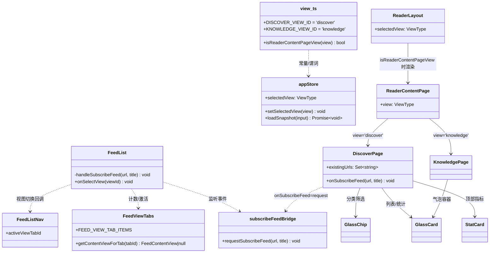
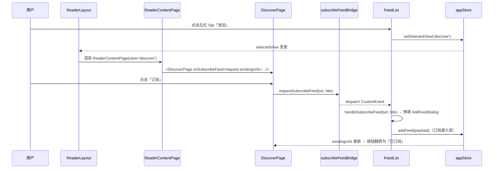

# FeedFuse 前端整合 + 玻璃视觉落地 — 实现方案与任务分解

> **版本**: v1.0 | **日期**: 2026-08-05 | **作者**: Architect（高见远）
> **状态**: 已定稿（用户已拍板三项决策，无需 PRD）
> **视觉唯一依据**: `docs/ui-style-guide.md` + `prototype/discover-glass.html`（不自创玻璃配方）
> **约束**: 简体中文；只消费语义 token / Tailwind 语义类（颜色只进 `globals.css` token）；最小增量、**禁删文件**；不破坏 readerSnapshot / 订阅 / 设置既有功能；三栏阅读器布局结构不改（只做视觉层）；**不引入新依赖**（玻璃用纯 CSS）。

---

## 1. 实现方案

### 1.1 视图并入：发现 / 知识库成为 ReaderApp 内的内容页视图

**结论（确定方案）**：不走「ReaderLayout 之上再加一层视图路由」，而是**把发现 / 知识库并入既有 `view.ts` + `appStore.selectedView` 视图机制**，在 `ReaderLayout` 中按视图分支渲染。这与 GitHub Tab（ADR-04 先例）同构：一个 view id = 一个左栏 Tab = 中/右内容区的一种渲染。

- `src/lib/reader/view.ts` 新增两个常量：
  - `DISCOVER_VIEW_ID = 'discover'`
  - `KNOWLEDGE_VIEW_ID = 'knowledge'`
  - 新增谓词 `isReaderContentPageView(view): boolean`（判定这两个 id）。
  - **明确不并入** `isAggregateView` / `SMART_MEDIA_VIEW_IDS` / `isRssSmartView` —— 内容页**不走 snapshot API**，并入会触发 `loadSnapshot({view:'discover'})` 打到无效接口。
- `appStore.selectedView` 无需改类型（`ViewType = 'all' | 'unread' | 'starred' | string` 天然可容纳），只加**守卫**：
  - `loadSnapshot` 入口早退：`if (isReaderContentPageView(view)) return;`（覆盖 ReaderApp 的 selectedView 联动 effect、visibilitychange 自动刷新等全部调用方，一处防护）。
- `ReaderLayout` 渲染分支：
  - **桌面**：`isReaderContentPageView(selectedView)` 为真时，渲染「左栏 FeedList + 左 ResizeHandle + 内容页面板（中栏+右栏合并为一个可滚动 `flex-1` 容器）」；否则维持现有三栏。
  - **平板/移动**：内容页视图时在内容区渲染同一内容页面板（替代 ArticleList/ArticleView），顶栏标题经 `MOBILE_SMART_VIEW_LABELS` 增加 `discover: '发现'` / `knowledge: '知识库'`。
  - 左栏（含 发现/知识库 入口）在任何视图下**永在** —— 满足「不再整页跳转、不丢菜单」。

#### 1.1.1 DiscoverPage / KnowledgePage 组件化改造点

| 组件 | 改造点 |
|------|--------|
| `DiscoverPage` | ① **去 `useRouter`**：删除 `router.push('/add-feed?...')` 回退分支（嵌入后 `onSubscribeFeed` 恒有值，独立路由不再直渲染本组件）；② `onSubscribeFeed` 接到**左栏订阅流**（见 1.1.3 订阅桥）；③ `existingUrls` 由 `ReaderContentPage` 从 store `feeds` 派生传入（`new Set(feeds.map(f => f.url))`），订阅后按钮自动翻转为「已订阅」；④ 视觉层玻璃化（见 1.3）。 |
| `KnowledgePage` | 无 props 变化（自带 `useKnowledgeStore`）；仅视觉层玻璃化（消息气泡/输入条/模式选择器/来源 chip），交互与状态流不动。 |

#### 1.1.2 路由去留：保留为兼容重定向（禁删文件）

| 路由文件 | 改动 |
|----------|------|
| `src/app/(reader)/discover/page.tsx` | 认证检查后改为 `redirect('/?view=discover')`（保留文件与 metadata，兼容旧链接/书签）。 |
| `src/app/(reader)/knowledge/page.tsx` | 同上，`redirect('/?view=knowledge')`。 |

`/?view=discover` 已天然可用：`page.tsx` 传 `initialSelectedView`，`appStore.readReaderSelectionFromUrl()` 从 URL 读 `view` 参数，ReaderApp 首屏即进入内容页视图。

#### 1.1.3 订阅流：DiscoverPage → 左栏订阅流（事件桥）

DiscoverPage 与 FeedList 分处不同面板，FeedList 的「预填 AddFeedDialog」流程是内部状态（`presetFeedUrl/presetFeedTitle/addFeedOpen`），不宜把整套 dialog 状态提升到 ReaderLayout。采用**最小事件桥**：

- 新增 `src/features/feeds/lib/subscribeFeedBridge.ts`：
  ```ts
  export const FEED_SUBSCRIBE_REQUEST_EVENT = 'feedfuse:subscribe-feed-request';
  export function requestSubscribeFeed(url: string, title: string): void {
    window.dispatchEvent(new CustomEvent(FEED_SUBSCRIBE_REQUEST_EVENT, { detail: { url, title } }));
  }
  ```
- `FeedList` 挂载时 `useEffect` 监听该事件 → 调用既有 `handleSubscribeFeed(url, title)`（关推荐弹窗、预填 preset、打开 AddFeedDialog）。
- `ReaderContentPage` 向 `DiscoverPage` 传 `onSubscribeFeed={requestSubscribeFeed}`。
- 收益：复用左栏完整订阅流（含校验/分类预填），零状态提升；测试可直接 dispatch 事件断言。

### 1.2 导航统一：左栏 Tab 扩展 + 移除整页跳转

- `FeedViewTabs.tsx`：
  - `FeedViewTabId` 联合类型新增 `typeof DISCOVER_VIEW_ID` / `typeof KNOWLEDGE_VIEW_ID`。
  - `FEED_VIEW_TAB_ITEMS` 顺序（图标沿用 lucide）：`全部(Newspaper) → 发现(Compass) → 知识库(Brain) → 文章(FileText) → 社交(MessageCircle) → 图片(Image) → 视频(Clapperboard) → 智能报告(Sparkles) → GitHub(Github)`。
  - `getContentViewForTab` 对两个新 Tab 返回 `null`（与 `'all'` 同语义，FeedList 的 `visibleFeeds` 因此自然为空）。
- `FeedViewSelector.tsx`（feed 编辑弹窗的「内容类型」选择器，复用 `FEED_VIEW_TAB_ITEMS`）**必须过滤**掉 `isReaderContentPageView(item.id)`，否则「发现/知识库」会污染订阅源内容类型选项。
- `FeedList.tsx`：
  - 删除 `useRouter` 与 `onDiscover={() => router.push('/discover')}` / `onKnowledge={() => router.push('/knowledge')}`（**这是用户不满的整页跳转源头**）。
  - `viewTabCounts` 初始化对象补 `discover: 0` / `knowledge: 0`（`FeedViewTabCountMap = Record<FeedViewTabId, number>` 类型强制）。
  - `activeViewTabId` 逻辑无需改：`isFeedViewTabId(renderedSelectedView)` 分支自然命中新 Tab。
  - `FeedListNav` 移除 `onDiscover`/`onKnowledge` props 与两个独立按钮（职责由 Tab 承担）。
- 侧栏「收藏文章」等其余导航不动。

### 1.3 玻璃视觉落地（globals.css token 方案 + Tailwind 4 接入 + 组件清单）

#### 1.3.1 主色（用户铁律优先）

| Token | 现状 | 新值（浅色） | 新值（深色） |
|-------|------|--------------|--------------|
| `--color-primary` | `hsl(221 100% 50%)` / `hsl(234 56% 60%)` | `hsl(152 60% 50%)` | `hsl(152 60% 50%)` |
| `--color-ring` | `hsl(221 100% 50%)` / `hsl(234 56% 60%)` | `hsl(152 60% 50%)` | `hsl(152 60% 50%)` |
| `--color-primary-foreground` | `0 0% 100%` / `240 20% 98%` | 保持 | 保持 |

> 注：ui-style-guide §1.1 建议浅色 `hsl(160 84% 39%)`，与用户铁律「浅色主色 `hsl(152 60% 50%)`」冲突 —— **以用户铁律为准**（两主题同值）。`success` 等其余语义色保持不动。改色后 `bg-primary/text-primary/ring-primary` 等所有 shadcn 基件（button/input/badge/card）自动继承，无需逐件改。

#### 1.3.2 玻璃 token（`globals.css` `@layer base` 的 `:root` 与 `.dark`）

深色主题（权威，按用户铁律 + prototype `.glass`）：

```css
--glass-bg: rgba(255, 255, 255, 0.04);       /* 半透明白 */
--glass-bg-strong: rgba(255, 255, 255, 0.055);
--glass-bg-light: rgba(255, 255, 255, 0.03);
--glass-border: rgba(255, 255, 255, 0.08);   /* 1px 白边框 */
--glass-blur: 16px;                           /* 用户铁律固定 16px */
--glass-blur-strong: 24px;
--glass-saturate: 140%;
--glass-highlight: rgba(255, 255, 255, 0.06); /* 内顶高光 */
--glass-topline: rgba(255, 255, 255, 0.13);   /* ::before 渐变高光线 */
--shadow-glass: 0 8px 32px rgba(0, 0, 0, 0.35);   /* 外阴影 */
--shadow-glow: 0 0 0 1px rgba(16, 185, 129, 0.25), 0 8px 24px rgba(16, 185, 129, 0.12);
--font-mono: ui-monospace, SFMono-Regular, "SF Mono", Menlo, monospace;
```

浅色主题：同一 token 结构，仅数值换浅色适配（颜色仍只存在于 globals.css token，组件不硬编码）——`--glass-bg: rgba(255,255,255,0.55)`、`--glass-border: rgba(15,23,42,0.08)`、`--glass-highlight/topline` 用白/浅灰系、`--shadow-glass: 0 8px 32px rgba(15,23,42,0.10)`。（**待明确项 #1**，若要求严格原型一致可强制仅深色玻璃。）

#### 1.3.3 body 光斑背景

- `.dark body`：按 ui-style-guide §1.2 emerald 配方（替换现有 indigo 微光）：
  ```css
  background-image:
    radial-gradient(circle at top, rgb(16 185 129 / 0.14), transparent 34%),
    radial-gradient(circle at 18% 18%, rgb(13 148 136 / 0.10), transparent 24%),
    radial-gradient(circle at 82% 12%, rgb(5 150 105 / 0.08), transparent 22%),
    linear-gradient(180deg, rgb(8 12 14 / 0.96), rgb(2 4 5 / 1));
  background-attachment: fixed;
  ```
- `:root body`（浅色）：加一层极淡 emerald 顶部光斑（`rgb(16 185 129 / 0.08)` 系）保证浅色下玻璃也有可模糊的底，数值定义在 globals.css。

#### 1.3.4 `.glass-surface` 工具类（纯 CSS，含 `-webkit-` 前缀）

在 `globals.css` 定义（`@layer components`），封装用户铁律完整配方；**组件只消费这些语义类，不再手写 blur/border/shadow 组合**：

```css
.glass-surface {
  position: relative;
  background: var(--glass-bg);
  -webkit-backdrop-filter: blur(var(--glass-blur)) saturate(var(--glass-saturate));
  backdrop-filter: blur(var(--glass-blur)) saturate(var(--glass-saturate));
  border: 1px solid var(--glass-border);
  box-shadow: var(--shadow-glass), inset 0 1px 0 var(--glass-highlight); /* 外阴影 + 内顶高光 */
  border-radius: 1rem;
}
.glass-surface::before { /* 顶部渐变高光线 */
  content: "";
  position: absolute; top: 0; left: 16%; right: 16%; height: 1px;
  background: linear-gradient(90deg, transparent, var(--glass-topline), transparent);
  pointer-events: none;
}
.glass-surface-strong { /* 导航/固定区：更实 */ background: var(--glass-bg-strong); backdrop-filter: blur(var(--glass-blur-strong)) saturate(150%); ... }
.glass-surface-light  { /* 卡片 hover/通透 */ background: var(--glass-bg-light); ... }
```

> 说明：`backdrop-filter` 由 Tailwind 工具类亦可产出（`backdrop-blur-[var(--glass-blur)] backdrop-saturate-[140%]` 会自动带 `-webkit-`），但完整配方（`::before` 高光线、内顶高光）用工具类拼写会重复且难维护，故收敛为 globals.css 语义类。组件内如需微调，用 Tailwind 语义类叠加（如 `rounded-xl`、`hover:border-primary/40`）。

#### 1.3.5 玻璃化组件清单（哪些玻璃、哪些保持）

| 区域/组件 | 处理 | 理由 |
|-----------|------|------|
| 左栏 `reader-feed-pane` | **玻璃化**（`glass-surface-strong`，整栏 1 层 blur） | 侧边栏是玻璃锚点；单容器 1 层 blur 性能安全 |
| `FeedViewTabs` 容器 | **玻璃化**（`glass-surface-light`） | 小容器，1 层 |
| 移动/平板顶栏 | 保持既有 `FROSTED_HEADER_CLASS_NAME`（已是玻璃），token 对齐即可 | 不新增 |
| **列表区**：`FeedTree` 行 / `ArticleList` 行 / 中栏列表容器 | **保持 token 配色，禁逐项 backdrop-blur** | 大量列表项 blur 会掉帧（ui-style-guide §6 风险项 + 用户要求权衡） |
| 右栏 `ArticleView` 容器 | 保持既有径向渐变背景（token 对齐） | 已是玻璃氛围 |
| `DiscoverPage` | **玻璃化**：StatCard×4（`GlassCard`）、搜索框（glass-light）、分类（`GlassChip`）、列表**行用 token 配色**（容器可套一层 `glass-surface`，行内不 blur）、RSS/GitHub 顶部 Tab 按原型 tab-bar | 统计卡/搜索/chips 数量少可 blur；列表行避免 N 层 blur |
| `KnowledgePage` | **玻璃化**：assistant 气泡 `glass-surface-light`、user 气泡 `bg-primary/90`、输入条/模式选择器/来源 chip 玻璃化 | 对话气泡数量可控；长对话若卡顿仅去掉气泡 blur 保留 token bg（一处类名切换） |
| `SettingsCenterDrawer/Modal` | 保持（已有玻璃质感），token 对齐 | ui-style-guide 非目标 |
| 基件 `ui/button|input|badge|card` | **保持结构**，主色/边框自动继承 token | 不重写基件 |

新增 `src/components/glass/`：
- `GlassCard.tsx`（`glass-surface` + `interactive?` / `padded?` / `className?`，hover 提亮边框）
- `StatCard.tsx`（GlassCard 变体：图标方块 `bg-primary/10 text-primary` + 数字 `font-mono tabular-nums` + 标签）
- `GlassChip.tsx`（玻璃筛选 chip，选中态 `bg-primary/15 text-primary border-primary/30`）
- `DetailDrawer` **本期不做**（prototype 有 repo 详情抽屉，但当前 DiscoverPage 无抽屉数据源；留待 GitHub 模块落地时复用 Sheet + glass token，ui-style-guide P2）。

### 1.4 测试影响

**必改（既有测试因主色变更而失败）**：
- `src/test/app/globals-css.contract.test.ts`：断言旧主色 `--color-primary: hsl(221 100% 50%)`（L41）/ `hsl(234 56% 60%)`（L48）/ `--color-ring: hsl(221 100% 50%)`（L43）—— 改为 `hsl(152 60% 50%)`，并**新增静态护栏**：断言 `--glass-bg` / `--glass-blur: 16px` / `--shadow-glass` / `--shadow-glow` / `--font-mono` / `.glass-surface` / `.dark body` emerald 渐变存在。

**影响评估（既有 138 失败债同源，勿纠缠）**：
- `FeedList.test.tsx`：现有断言均不引用「发现/知识库」独立按钮；Tab 顺序断言为两两 `compareDocumentPosition`，插入新 Tab 不破坏相对顺序；`renders Folo-style view tabs...` / `selects Folo-style view tabs...` 均不受影响。仅需**增量**加断言（见下）。
- `ReaderApp.test.tsx`：默认 `selectedView='all'`，store 守卫不影响既有路径。

**需新增测试**：
1. `src/test/lib/reader/view.test.ts`：`isReaderContentPageView` 对 `discover/knowledge` 为真、对 `all/github/smart-*` 为假；常量值。
2. `FeedList.test.tsx` 增量：点击 Tab「发现」→ `selectedView === 'discover'`；点击「知识库」→ `'knowledge'`；断言**无整页跳转**（`window.location.pathname` 不变 / 无 `/discover` 请求）。
3. `src/test/features/reader/ReaderContentPage.test.tsx`：mock `DiscoverPage`/`KnowledgePage`，断言 `selectedView='discover'` 渲染 Discover、`'knowledge'` 渲染 Knowledge、其他视图返回空。
4. `src/test/components/glass/glass-components.test.tsx`：GlassCard/StatCard/GlassChip 渲染出 `glass-surface` 语义类（冒烟）。

---

## 2. 文件列表

### 新增（+）

| 文件 | 说明 |
|------|------|
| `src/components/glass/GlassCard.tsx` | 玻璃卡片基件 |
| `src/components/glass/StatCard.tsx` | 统计卡片（GlassCard 变体） |
| `src/components/glass/GlassChip.tsx` | 玻璃筛选 chip |
| `src/features/feeds/lib/subscribeFeedBridge.ts` | 订阅请求事件桥（DiscoverPage → FeedList） |
| `src/features/reader/components/ReaderContentPage.tsx` | 内容页视图面板（Discover/Knowledge 按 view 渲染） |
| `src/test/lib/reader/view.test.ts` | view.ts 谓词单测 |
| `src/test/features/reader/ReaderContentPage.test.tsx` | 内容页视图渲染测试 |
| `src/test/components/glass/glass-components.test.tsx` | glass 组件冒烟测试 |

### 修改（~）

| 文件 | 改动性质 |
|------|----------|
| `src/app/globals.css` | 主色改青绿 + `--glass-*`/`--shadow-*`/`--font-mono` token + body 光斑 + `.glass-surface` 系列类 |
| `src/lib/reader/view.ts` | 新增 `DISCOVER_VIEW_ID`/`KNOWLEDGE_VIEW_ID` + `isReaderContentPageView` |
| `src/store/appStore.ts` | `loadSnapshot` 对内容页视图早退守卫 |
| `src/features/feeds/components/FeedViewTabs.tsx` | 新增 发现/知识库 Tab + 类型/计数 map 扩展 |
| `src/features/feeds/components/FeedViewSelector.tsx` | 过滤内容页 Tab（防污染 feed 类型选择器） |
| `src/features/feeds/components/FeedList.tsx` | 去 `useRouter`/`router.push`；counts 补新键；监听订阅桥 |
| `src/features/feeds/components/FeedListNav.tsx` | 移除独立 发现/知识库 按钮与 props |
| `src/features/reader/components/ReaderLayout.tsx` | 内容页视图分支（桌面/移动）+ 移动标题 label + 左栏/内容面板玻璃化 |
| `src/app/(reader)/discover/page.tsx` | 改为 `redirect('/?view=discover')` |
| `src/app/(reader)/knowledge/page.tsx` | 改为 `redirect('/?view=knowledge')` |
| `src/features/discover/components/DiscoverPage.tsx` | 去 router 回退 + 玻璃化 + 订阅流接入 |
| `src/features/knowledge/components/KnowledgePage.tsx` | 玻璃化（气泡/输入条/chips），结构不动 |
| `src/test/app/globals-css.contract.test.ts` | 主色断言更新 + 玻璃 token 静态护栏 |
| `src/test/features/feeds/FeedList.test.tsx` | 增量：发现/知识库 Tab 切换 + 无整页跳转断言 |

> 不改：`src/app/(reader)/page.tsx`（已支持 `?view=` 参数）、`src/components/ui/*`（基件结构）、`src/features/settings/*`、三栏布局结构、`tailwind.config`（根项目无 Tailwind 4 config 文件，主题走 globals.css `@theme`）。

---

## 3. 数据 / 状态契约

### 3.1 `appStore.selectedView` 扩展

- `ViewType` 类型不变；新增合法取值：`'discover'` / `'knowledge'`（仅通过 `view.ts` 常量引用，**组件内禁止字符串字面量**）。
- `setSelectedView` 无需特判（articles 快照缓存对内容页为空数组，无害）；`loadSnapshot` 加守卫防无效 API 调用。
- URL 同步：`persistReaderSelectionToUrl` 自动把 `?view=discover` 写入地址栏 —— 内容页视图天然可深链、可刷新恢复。

### 3.2 ReaderApp 视图渲染契约

```
selectedView
├─ 'all' | 'unread' | 'starred' | <feedId> | 'smart-*' | 'ai-digest' | 'github'
│    → ReaderLayout 三栏（左 FeedList + 中 ArticleList + 右 ArticleView）  [现状]
└─ 'discover' | 'knowledge'   [新增]
     → ReaderLayout 左栏（FeedList，永在） + ReaderContentPage（中+右合并，可滚动）
        ├─ discover  → <DiscoverPage onSubscribeFeed={requestSubscribeFeed} existingUrls={set(feeds.urls)} />
        └─ knowledge → <KnowledgePage />
```

### 3.3 类图（关键结构）



### 3.4 关键时序（订阅 + 视图切换）



---

## 4. 任务列表（有序，按实现顺序）

> 任务 ID 与共享任务列表一致；工程师严格按依赖实现。

### T01 视觉基建：青绿主色 + 玻璃 token + glass 基件 + 契约测试（P0）
- **文件**：`src/app/globals.css`、`src/components/glass/GlassCard.tsx`、`src/components/glass/StatCard.tsx`、`src/components/glass/GlassChip.tsx`、`src/test/app/globals-css.contract.test.ts`（更新+护栏）、`src/test/components/glass/glass-components.test.tsx`（新增）
- **依赖**：无
- **要点**：主色 `hsl(152 60% 50%)` 两主题统一；`--glass-*` token 按 §1.3.2；`.glass-surface` 系列按 §1.3.4；`.dark body` emerald 光斑；契约测试同步改（旧断言必挂）。**验收**：`pnpm test:unit src/test/app/globals-css.contract.test.ts src/test/components/glass` 通过；无组件硬编码颜色。

### T02 视图并入与导航统一（P0）
- **文件**：`src/lib/reader/view.ts`、`src/store/appStore.ts`、`src/features/feeds/lib/subscribeFeedBridge.ts`、`src/features/feeds/components/FeedViewTabs.tsx`、`src/features/feeds/components/FeedViewSelector.tsx`、`src/features/feeds/components/FeedList.tsx`、`src/features/feeds/components/FeedListNav.tsx`、`src/test/lib/reader/view.test.ts`（新增）、`src/test/features/feeds/FeedList.test.tsx`（增量）
- **依赖**：无（可与 T01 并行）
- **要点**：`DISCOVER_VIEW_ID`/`KNOWLEDGE_VIEW_ID` + `isReaderContentPageView`；`loadSnapshot` 早退守卫；Tab 新增与顺序；FeedViewSelector 过滤；FeedList 去 router、补 counts、监听订阅桥；FeedListNav 去独立按钮。**验收**：`view.test.ts` 通过；`FeedList.test.tsx` 全绿（含新增 Tab 切换断言）；`pnpm type-check` 通过。

### T03 阅读器内容页视图渲染与路由（P0）
- **文件**：`src/features/reader/components/ReaderContentPage.tsx`（新增）、`src/features/reader/components/ReaderLayout.tsx`、`src/app/(reader)/discover/page.tsx`、`src/app/(reader)/knowledge/page.tsx`、`src/test/features/reader/ReaderContentPage.test.tsx`（新增）
- **依赖**：T02（view 常量/谓词）
- **要点**：ReaderContentPage 按 view 渲染 DiscoverPage/KnowledgePage（`h-full overflow-y-auto`，桌面/移动共用）；ReaderLayout 桌面/移动分支 + `MOBILE_SMART_VIEW_LABELS` 补 label；两路由改重定向（禁删文件）。**验收**：`ReaderContentPage.test.tsx` 通过；`/?view=discover` 手测进入发现页且左栏保留。

### T04 页面玻璃化落地与收尾（P1）
- **文件**：`src/features/discover/components/DiscoverPage.tsx`、`src/features/knowledge/components/KnowledgePage.tsx`、`src/features/reader/components/ReaderLayout.tsx`（左栏/内容面板换 glass 类）
- **依赖**：T01 + T02 + T03
- **要点**：DiscoverPage 去 `useRouter` 回退 + StatCard 行 + 搜索/chips/列表玻璃化（列表行 token 配色、不逐项 blur）+ RSS/GitHub 顶部 Tab（GitHub 无数据时空态占位，见待明确 #5）；KnowledgePage 气泡/输入条/chips 玻璃化（长对话性能权衡）；左栏 `glass-surface-strong`、Tab 容器 `glass-surface-light`。**验收**：`pnpm type-check && pnpm test:unit && pnpm lint` 全绿；`pnpm dev` 手测三视图切换 + 订阅流 + 深/浅色玻璃观感。

---

## 5. 共享知识（跨文件约定）

- **视图 ID 规范**：内容页视图常量只在 `src/lib/reader/view.ts` 定义（`DISCOVER_VIEW_ID='discover'` / `KNOWLEDGE_VIEW_ID='knowledge'`）；组件一律引用常量，**禁止字符串字面量**；内容页不进入 `isAggregateView`/`SMART_MEDIA_VIEW_IDS`/`isRssSmartView`。
- **颜色纪律**：颜色值**只允许出现在 `globals.css` token**；组件只消费 Tailwind 语义类（`bg-primary`、`text-muted-foreground`、`border-border`…）或 `var(--glass-*)` 任意值类；新增颜色一律先加 token。
- **glass 类名命名**：`.glass-surface` / `.glass-surface-strong` / `.glass-surface-light` 定义于 globals.css；新玻璃面优先复用，不手写 `backdrop-filter`/`box-shadow` 组合。
- **backdrop-blur 性能铁律**：每个面板/容器最多 1 层 blur；**列表行（FeedTree/ArticleList/发现列表）禁逐项 blur**，只用 token 配色；长对话场景气泡 blur 若卡顿，去掉 blur 保留 token bg（一处类名切换）。
- **订阅流**：发现页订阅一律走 `requestSubscribeFeed(url,title)` 事件桥 → FeedList 监听 → 复用 AddFeedDialog 预填流程；禁止 DiscoverPage 直接 `router.push`。
- **数字排版**：统计数字用 `--font-mono` + `tabular-nums`。
- **测试约定**：渲染 ReaderLayout 的测试需 stub fetch（沿用 `FeedList.test.tsx` 模式）；ReaderContentPage 测试 mock DiscoverPage/KnowledgePage 隔离数据请求。
- **API/日期约定**：沿用现有（`{ok,data}` 包装、ISO 8601 UTC），本期无后端改动。

---

## 6. 待明确事项

1. **浅色主题玻璃数值**：用户铁律配方 `rgba(255,255,255,0.04)` 为深色设计；浅色主题默认提供同结构浅色适配 token（已在 §1.3.2 给出默认值）。若产品要求严格原型一致（仅深色玻璃），请确认 —— 默认按「双主题都玻璃化」实施。
2. **订阅交互**：发现页订阅默认接左栏 AddFeedDialog（可改标题/分类再保存）；若希望「一键直订阅」（跳过弹窗，直接 `store.addFeed`），请确认。
3. **主色浅色值**：用户铁律 `hsl(152 60% 50%)` 与 ui-style-guide 建议 `hsl(160 84% 39%)` 冲突，本方案以铁律为准（两主题同值）。
4. **DetailDrawer**：prototype 有 repo 详情抽屉，本期不做（当前 DiscoverPage 无抽屉数据源），留待 GitHub 模块落地（ui-style-guide P2）。
5. **发现页 RSS/GitHub 顶部 Tab**：prototype 有该 Tab，但 GitHub 数据源（PRD R12）未实现 —— 默认加 UI（tab-bar 玻璃化）、GitHub 面板显示「即将上线」空态占位；如需本期完全不加，请确认。
6. **`layout.tsx` viewport `themeColor`**（`#f6f7f8` / `#111a30`）：浏览器外壳色，非组件色，可选对齐 emerald（低优先，默认不动）。
